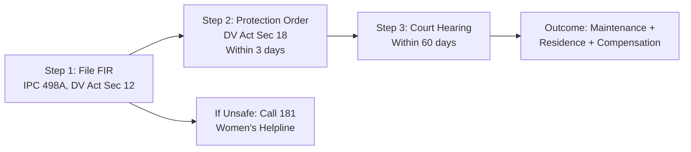

# Nyaya Saathi — Master Execution Plan

> **One document. Everything you need. Follow it top to bottom.**

---

## Table of Contents

1. [Situation Assessment](#1-situation-assessment)
2. [AWS Services Scorecard (14 Services)](#2-aws-services-scorecard-14-services)
3. [Complete Feature Kill-Stack (26 Features, Priority Order)](#3-complete-feature-kill-stack-26-features-priority-order)
4. [Core Features — Implementation Details](#4-core-features--implementation-details)
5. [Competition Killers — The 7 Features Nobody Else Will Have](#5-competition-killers--the-7-features-nobody-else-will-have)
6. [What to Skip (And Why)](#6-what-to-skip-and-why)
7. [Day-by-Day Build Schedule (200 Hours / 15 Days)](#7-day-by-day-build-schedule-200-hours--15-days)
8. [Crescendo Demo Script (3 Minutes, 6 Acts)](#8-crescendo-demo-script-3-minutes-6-acts)
9. [10-Slide PPT Outline](#9-10-slide-ppt-outline)
10. [Scoring Map — How Features Map to Rubric](#10-scoring-map--how-features-map-to-rubric)
11. [Risk Register](#11-risk-register)
12. [Submission Checklist](#12-submission-checklist)
13. [Judge Q&A — Prepared Answers](#13-judge-qa--prepared-answers)
14. [Measurable Claims for Judges](#14-measurable-claims-for-judges)
15. [Competition Comparison Table](#15-competition-comparison-table)
16. [Critical Success Factors](#16-critical-success-factors)

---

## 1. Situation Assessment

| Factor | Reality | Strategic Implication |
|--------|---------|----------------------|
| **Team** | Solo developer | Every hour must have ROI. AI tools (Copilot, Kiro, ChatGPT, v0/Bolt) are force multipliers. |
| **Skill** | AWS beginner | AWS debugging will eat ~40% of time. Budget 2x for every AWS setup task. |
| **Time** | ~200 hours (10-12h/day) | Enough for polished prototype + competition killers IF disciplined. |
| **Build status** | Zero code written | Clean start. No tech debt. |
| **Frontend** | React/Next.js via v0/Bolt | UI will look 10x more professional than any Streamlit team. Major advantage. |
| **AI tools** | Copilot + Kiro + ChatGPT + v0/Bolt | Code generation is 5-10x faster, but AWS config/IAM still require manual debugging. |
| **Demo format** | Live demo + video | Video is safety net. Live demo must be bulletproof with fallbacks. |
| **Demo style** | Crescendo — build pace → hook → climax | Requires deliberate "holy shit" ending moment (Polly TTS). |
| **AWS access** | Full credits | No cost constraints — use Bedrock aggressively. |
| **Kiro** | Explicitly in rubric | **FREE POINTS.** Set it up Day 1. Screenshot for slides. |
| **Competition** | Everyone has chatbot + RAG + docs + Hindi | These are price of entry. 7 competition killers differentiate you. |
| **Scoring** | AWS GenAI depth, AWS infra quality, working prototype, AI value explanation | Name-drop services, show architecture, demo must work, frame AI value. |

---

## 2. AWS Services Scorecard (14 Services)

| # | AWS Service | How You Use It | Category |
|---|------------|---------------|----------|
| 1 | **Amazon Bedrock (Foundation Models)** | Claude Sonnet for reasoning, Nova Lite for classification | GenAI |
| 2 | **Amazon Bedrock Knowledge Bases** | RAG over 15 legal acts | GenAI |
| 3 | **Amazon Bedrock Guardrails** | Content filtering, denied topics, PII protection | GenAI |
| 4 | **Amazon Bedrock Agents** | Orchestrate multi-step pipeline (if time) | GenAI |
| 5 | **Amazon Titan Embeddings V2** | Vector embeddings for semantic search | GenAI |
| 6 | **Amazon Polly** | Hindi text-to-speech (Kajal neural voice) | AI/ML |
| 7 | **Amazon Textract** | Document scanning — "Scan Your Notice" feature | AI/ML |
| 8 | **Amazon OpenSearch Serverless** | Vector store for Knowledge Base | Infrastructure |
| 9 | **AWS Lambda** | Serverless compute for all processing | Infrastructure |
| 10 | **Amazon API Gateway** | REST API for non-streaming endpoints | Infrastructure |
| 11 | **Lambda Function URLs** | Streaming endpoint for chat responses | Infrastructure |
| 12 | **Amazon S3** | Legal corpus, DLSA directory, Polly audio | Infrastructure |
| 13 | **AWS Amplify** | React frontend hosting with CI/CD | Infrastructure |
| 14 | **Amazon CloudWatch** | Monitoring dashboard, logging | Infrastructure |
| 15 | **AWS IAM** | Least-privilege access control | Security |
| 16 | **Kiro** | Spec-driven development workflow | Dev Tool |

> **In your demo, say:** "Nyaya Saathi uses 14 AWS services across GenAI, AI/ML, infrastructure, and security layers."

---

## 3. Complete Feature Kill-Stack (26 Features, Priority Order)

Build these top to bottom. Each row is one unit of work. **MUST** = build no matter what. **HIGH** = build after all MUSTs. **NICE** = if still have time. **IF TIME** = only if everything else is done.

| # | Feature | Type | Hours | Priority | Notes |
|---|---------|------|-------|----------|-------|
| 1 | Kiro setup + screenshots | Scoring | 2-3 | **MUST** | Day 1. Free points. In rubric. |
| 2 | S3 + Bedrock KB + Guardrails setup | Infrastructure | 8-10 | **MUST** | Foundation for everything. |
| 3 | Intent Classifier Lambda | Core | 4-5 | **MUST** | Nova Lite, fast, cheap. |
| 4 | Situation Analyzer Lambda | Core | 4-5 | **MUST** | Nova Lite, fact extraction. |
| 5 | Rights Explainer Lambda + RAG | Core | 10-12 | **MUST** | Claude Sonnet. Hardest part. Iterate on prompts. |
| 6 | Document Drafter Lambda | Core | 6-8 | **MUST** | 4 templates: RTI, FIR, complaint, legal aid app. |
| 7 | API Gateway + Lambda wiring | Infrastructure | 3-4 | **MUST** | REST endpoints for non-streaming. |
| 8 | Amazon Polly TTS integration | **KILLER #7** | 6-8 | **MUST** | Hindi Kajal neural voice. Demo climax. |
| 9 | Lambda Function URL (streaming) | Infrastructure | 6-8 | **MUST** | ChatGPT-style word-by-word display. |
| 10 | React frontend via v0/Bolt | Frontend | 10-15 | **MUST** | Generate full UI layout. Professional look. |
| 11 | Front-backend integration | Integration | 6-8 | **MUST** | Connect all APIs + streaming. |
| 12 | Hindi/English toggle | Feature | 3-4 | **MUST** | Visual impact. Most teams won't have Hindi. |
| 13 | PDF document export | Feature | 4-6 | **MUST** | @react-pdf/renderer. "Ready to print." |
| 14 | Side-by-side legal vs simple | Feature | 2-3 | **MUST** | Proves AI value visually. |
| 15 | IPC → BNS comparison cards | **KILLER #3** | 3-4 | **MUST** | Shows legal currency. Zero other teams have this. |
| 16 | Emergency safety detection | Feature | 3-4 | **MUST** | Helpline numbers (100, 181, 1098). Responsible AI. |
| 17 | Visual Legal Journey (Mermaid) | **KILLER #2** | 5-6 | **MUST** | Flowchart > text wall. Memorable visual. |
| 18 | Case Strength Indicator | **KILLER #4** | 5-6 | **HIGH** | Progress bar + evidence checklist. "Legal strategy assistant." |
| 19 | Amazon Textract doc scanning | **KILLER #1** | 8-10 | **HIGH** | Upload photo → AI explains. +1 AWS service. |
| 20 | Multi-path comparison | **KILLER #5** | 5-6 | **HIGH** | 3 legal paths side-by-side with recommendation. |
| 21 | Voice input (Web Speech API) | Feature | 2-3 | **HIGH** | Browser-native. Fallback = text. |
| 22 | Legal Rights Quiz | **KILLER #6** | 6-8 | **HIGH** | Gamified discovery. Interactive = memorable. |
| 23 | DLSA Finder | Feature | 5-6 | **NICE** | JSON lookup + fuzzy matching. |
| 24 | Proactive "Know Your Rights" | Feature | 4-5 | **NICE** | Guided checkbox entry. |
| 25 | Bedrock Agents orchestration | Advanced | 8-12 | **IF TIME** | Replace manual Lambda chaining. |
| 26 | CloudWatch dashboard | Infrastructure | 0.5 | **IF TIME** | Screenshot for PPT. |

**Hour totals:**
- **MUST:** ~85-105 hours
- **HIGH:** ~27-33 hours
- **NICE:** ~9-11 hours
- **IF TIME:** ~10-15 hours
- **Buffer (AWS debugging, demo prep, video, PPT, sleep):** ~40-60 hours

With 200 hours, you complete MUST + HIGH + NICE comfortably with buffer.

---

## 4. Core Features — Implementation Details

### 4.1 Core RAG Pipeline (3-Stage Prompt Chain)

```
S3 (15 legal act PDFs + simplified guides)
  → Bedrock Knowledge Base (Titan Embeddings V2 + OpenSearch Serverless)
  → Lambda 1: Intent Classifier (Bedrock Nova Lite — cheap, fast)
  → Lambda 2: Situation Analyzer (Bedrock Nova Lite)
  → Lambda 3: Rights Explainer (Bedrock Claude Sonnet — high quality, RAG)
  → Lambda 4: Document Drafter (Bedrock Claude Sonnet)
  → Lambda 5: DLSA Finder (S3 JSON lookup)
  → API Gateway (REST) + Lambda Function URL (streaming)
  → React/Next.js Frontend (Amplify hosted)
```

**Success metric:** User describes a domestic violence situation in Hindi → gets back 3+ applicable rights with Act/Section citations in under 15 seconds.

---

### 4.2 Amazon Polly Hindi TTS

```python
# In Rights Explainer Lambda (add Polly call)
import boto3
polly = boto3.client('polly', region_name='ap-south-1')

def generate_speech(text, language='hi-IN'):
    response = polly.synthesize_speech(
        Text=text,
        OutputFormat='mp3',
        VoiceId='Kajal',  # Hindi neural voice
        Engine='neural',
        LanguageCode=language
    )
    # Return audio stream or upload to S3 pre-signed URL
    return response['AudioStream'].read()
```

```jsx
// React frontend — play button on rights card
<button onClick={() => {
  const audio = new Audio(audioUrl);
  audio.play();
}}>
  🔊 सुनें (Listen)
</button>
```

**Demo moment:** "25% of Indian women are illiterate. They can't read this screen. But they can hear it." → Click play → Hindi voice reads rights aloud → Let it play 8 seconds → Don't talk over it.

---

### 4.3 Streaming Responses

```python
# Lambda uses Bedrock converse_stream API
import boto3
bedrock = boto3.client('bedrock-runtime')

response = bedrock.converse_stream(
    modelId='anthropic.claude-3-sonnet-20240229-v1:0',
    messages=[...],
)

# Stream chunks back via Lambda Function URL
for event in response['stream']:
    if 'contentBlockDelta' in event:
        yield event['contentBlockDelta']['delta']['text']
```

```jsx
// React frontend — streaming display
const response = await fetch('/api/chat', { method: 'POST', body: ... });
const reader = response.body.getReader();
const decoder = new TextDecoder();

while (true) {
  const { done, value } = await reader.read();
  if (done) break;
  setMessages(prev => prev + decoder.decode(value));
}
```

**Note:** Use Lambda Function URLs for streaming (not API Gateway REST). Use API Gateway for non-streaming endpoints (DLSA finder, document download). If streaming breaks during demo, response appears all at once — invisible fallback.

---

### 4.4 Bedrock Guardrails

```python
# Apply guardrail to every Bedrock invocation
response = bedrock.converse(
    modelId='anthropic.claude-3-sonnet-20240229-v1:0',
    messages=[...],
    guardrailConfig={
        'guardrailIdentifier': 'your-guardrail-id',
        'guardrailVersion': '1'
    }
)
```

**Configure these guardrails in the Bedrock console:**
- **Denied topics:** "Case outcome prediction", "Encouraging illegal activity", "Medical/financial advice"
- **Content filters:** Block hate speech, violence glorification, sexual content
- **Word filters:** Block specific harmful terms
- **Sensitive info filters:** Block PII in responses (Aadhaar numbers, phone numbers)

**Effort:** 1-2 hours. Free AWS service point. Responsible AI narrative.

---

### 4.5 PDF Document Export

```jsx
// Use @react-pdf/renderer
import { PDFDownloadLink, Document, Page, Text, View } from '@react-pdf/renderer';

const ComplaintPDF = ({ document, metadata }) => (
  <Document>
    <Page style={styles.page}>
      <Text style={styles.header}>शिकायत पत्र / Complaint Letter</Text>
      <Text style={styles.address}>{metadata.authority}</Text>
      <Text style={styles.date}>[DATE]</Text>
      <Text style={styles.body}>{document.body}</Text>
      <Text style={styles.signature}>[YOUR NAME]</Text>
      <Text style={styles.disclaimer}>
        यह मार्गदर्शन है, कानूनी सलाह नहीं
      </Text>
    </Page>
  </Document>
);

<PDFDownloadLink document={<ComplaintPDF {...props} />} fileName="complaint.pdf">
  {({ loading }) => loading ? 'Generating PDF...' : '📄 Download PDF'}
</PDFDownloadLink>
```

---

### 4.6 Side-by-Side: Raw Legal Text vs AI Explanation

```
┌─────────────────────────────┬─────────────────────────────┐
│ 📜 Original Legal Text      │ 💡 Nyaya Saathi Explanation  │
│                             │                             │
│ "Section 17 of the PWDVA    │ "कानून कहता है कि आपको      │
│ provides that every woman   │ अपने ससुराल के घर में रहने  │
│ in a domestic relationship  │ का पूरा अधिकार है। कोई भी  │
│ shall have the right to     │ आपको घर से निकाल नहीं      │
│ reside in the shared        │ सकता।"                      │
│ household..."               │                             │
└─────────────────────────────┴─────────────────────────────┘
```

Include the RAG-retrieved chunks in the API response. Display them in a split-panel React component. v0/Bolt can generate this layout in minutes.

---

### 4.7 Voice Input (Web Speech API — Browser Native)

```jsx
const VoiceInput = ({ onTranscript }) => {
  const startListening = () => {
    const recognition = new (window.SpeechRecognition || window.webkitSpeechRecognition)();
    recognition.lang = 'hi-IN'; // Hindi
    recognition.onresult = (event) => {
      onTranscript(event.results[0][0].transcript);
    };
    recognition.start();
  };

  return <button onClick={startListening}>🎤</button>;
};
```

**Effort:** 2-3 hours. Fallback = type text. No AWS service needed (browser-native).

---

## 5. Competition Killers — The 7 Features Nobody Else Will Have

### The Brutal Truth

| Feature | Your Plan | What Judges See |
|---------|-----------|-----------------|
| RAG over legal acts | ✅ | "Another RAG chatbot." |
| Hindi/English | ✅ | "Most teams did this." |
| Document generation | ✅ | "A few teams have this too." |
| Prompt chaining | ✅ | "Nice, but invisible." |
| Source citations | ✅ | "Good practice, but expected." |

**These are price of entry. They prevent you from losing. To WIN, you need moments where judges go: "Nobody else did that."**

---

### KILLER #1: "Scan Your Notice" — Amazon Textract (8-10 hours)

**Chance other teams have this: ~2%**

A woman receives a legal notice she can't read. She takes a photo → uploads it → Amazon Textract extracts text → AI explains what it means, whether it's legally valid, what she should do, and by when.

```python
# New Lambda: Document Analyzer
import boto3

textract = boto3.client('textract', region_name='ap-south-1')
bedrock = boto3.client('bedrock-runtime', region_name='ap-south-1')

def analyze_document(image_bytes):
    # Step 1: Extract text from image
    textract_response = textract.detect_document_text(
        Document={'Bytes': image_bytes}
    )
    
    extracted_text = ' '.join([
        block['Text'] for block in textract_response['Blocks']
        if block['BlockType'] == 'LINE'
    ])
    
    # Step 2: Send to Bedrock for legal analysis
    prompt = f"""You are a legal document analyst for India. A user has uploaded 
    a document they received. Analyze it and explain:
    
    1. What type of document this is (court notice, legal notice, eviction order, etc.)
    2. Is it from a legitimate authority? (identify sender)
    3. What it's asking the person to do
    4. What is the deadline to respond (if any)
    5. Is it legally binding or just an intimidation tactic?
    6. What should the person do next — step by step
    7. Which legal provisions are cited and what they mean in simple language
    
    Respond in simple Hindi (Class 8 reading level) if the document is in 
    Hindi, or in English if the document is in English.
    
    IMPORTANT: If you cannot determine authenticity, say so clearly 
    and recommend consulting a lawyer or DLSA.
    
    Document text:
    {extracted_text}"""
    
    response = bedrock.converse(
        modelId='anthropic.claude-3-sonnet-20240229-v1:0',
        messages=[{"role": "user", "content": [{"text": prompt}]}]
    )
    
    return {
        "extracted_text": extracted_text,
        "analysis": response['output']['message']['content'][0]['text'],
    }
```

```jsx
// React frontend — upload component
const DocumentScanner = () => {
  const [analysis, setAnalysis] = useState(null);
  
  const handleUpload = async (e) => {
    const file = e.target.files[0];
    const formData = new FormData();
    formData.append('document', file);
    
    const res = await fetch('/api/analyze-document', { method: 'POST', body: formData });
    setAnalysis(await res.json());
  };
  
  return (
    <div>
      <label className="upload-zone">
        📸 Upload a legal notice, court order, or any document you received
        <input type="file" accept="image/*" capture="environment" onChange={handleUpload} />
      </label>
      {analysis && <DocumentAnalysisCard analysis={analysis} />}
    </div>
  );
};
```

**Demo moment:** "What if she receives a document she can't read?" → Upload photo of Hindi legal notice → "Amazon Textract extracts the text. The AI tells her: this is a court summons, not an eviction. She must appear on March 15. Here's what to carry."

**Why it kills:** Different input modality. +1 AWS service. Solves a REAL problem (fake legal notice intimidation). Visceral demo moment.

---

### KILLER #2: Visual Legal Journey Map — Mermaid.js Flowchart (5-6 hours)

**Chance other teams have this: ~3%**

Every other team outputs text lists. You output a visual, interactive legal journey map.

```python
# Add to Rights Explainer prompt:
"""
After explaining the rights, generate a Mermaid.js flowchart showing the 
step-by-step legal journey. Use this format:



Keep it to 4-6 steps maximum. Use Hindi labels if language is Hindi.
"""
```

```jsx
// React component using mermaid library
import mermaid from 'mermaid';

const LegalJourneyMap = ({ mermaidCode }) => {
  const ref = useRef(null);
  
  useEffect(() => {
    mermaid.initialize({ theme: 'base' });
    mermaid.render('journey-map', mermaidCode).then(({ svg }) => {
      ref.current.innerHTML = svg;
    });
  }, [mermaidCode]);
  
  return (
    <div className="journey-map-container">
      <h3>📍 Your Legal Journey</h3>
      <div ref={ref} />
    </div>
  );
};
```

**Why it kills:** A flowchart is a photograph in judges' memory. Shows AI can reason about sequential legal processes. Answers "What do I do FIRST?"

---

### KILLER #3: IPC → BNS Comparison Cards (3-4 hours)

**Chance other teams have this: ~1%**

India replaced 3 foundational laws in July 2024 (IPC → BNS, CrPC → BNSS, Evidence Act → BSA). Even most lawyers are still adjusting.

```python
# Add to Rights Explainer prompt:
"""
When citing criminal provisions, ALWAYS show both old and new law:

Format:
"[OLD] IPC Section 498A → [NEW] BNS Section 85-86
Both protect against cruelty by husband or his relatives."

This is critical because court records still reference IPC, but new FIRs use BNS.
"""
```

```jsx
const LawComparisonCard = ({ oldLaw, newLaw, explanation }) => (
  <div className="law-comparison">
    <div className="old-law">
      <span className="badge badge-amber">पुराना कानून / Old Law</span>
      <p>{oldLaw}</p>
    </div>
    <div className="arrow">→</div>
    <div className="new-law">
      <span className="badge badge-green">नया कानून / New Law</span>
      <p>{newLaw}</p>
    </div>
    <p className="explanation">{explanation}</p>
  </div>
);
```

**Why it kills:** Shows Knowledge Base is current. Makes other teams' IPC-only citations look dated. Zero extra AWS cost — prompt engineering + RAG content.

---

### KILLER #4: Case Strength Indicator + Evidence Checklist (5-6 hours)

**Chance other teams have this: ~2%**

After identifying rights, AI evaluates case strength and tells user exactly what evidence to collect.

```
╔══════════════════════════════════════════════════╗
║  📊 Case Strength Assessment                    ║
║                                                  ║
║  Current Strength: ████████░░ 75% (Strong)       ║
║                                                  ║
║  ✅ You have: Clear description of abuse         ║
║  ✅ You have: Timeline of incidents              ║
║  ⚠️  Missing: Medical records / injury photos    ║
║  ⚠️  Missing: Witness statements                 ║
║                                                  ║
║  📋 Collect These:                               ║
║  □ Photos of injuries (with date stamp)    +10%  ║
║  □ Medical report from govt hospital       +8%   ║
║  □ Statement from neighbor/relative        +5%   ║
║  □ Messages/recordings showing threats     +7%   ║
║                                                  ║
║  💡 Collecting 2+ more → case strength ~90%      ║
╚══════════════════════════════════════════════════╝
```

```python
case_strength_prompt = """
Based on the user's situation and applicable legal provisions, assess case strength:

1. Rate 0-100% based on: clarity of violation, specificity of facts, evidence mentioned, 
   number of applicable provisions
2. List what user HAS in their favor
3. List what EVIDENCE to collect (medical records, photos, witnesses, communications, 
   financial records)
4. Generate prioritized checklist (max 7 items) with impact percentage
5. Estimate improvement with each piece of evidence

Output as structured JSON:
{
  "strength_score": 75,
  "strength_label": "Strong",
  "has": ["clear description", "timeline"],
  "missing": ["medical records", "witnesses"],
  "checklist": [
    {"item": "Photos of injuries with date", "impact": "+10%"},
    {"item": "Medical report from hospital", "impact": "+8%"}
  ],
  "summary_hi": "Hindi summary...",
  "summary_en": "English summary..."
}
"""
```

**Why it kills:** Transforms from "here are your rights" (passive) to "here's how to WIN" (active). Shows AI reasoning depth. Progress bar is visually memorable.

---

### KILLER #5: Multi-Path Comparison — "What If" Analysis (5-6 hours)

**Chance other teams have this: ~1%**

Show multiple legal paths side by side with different outcomes, timelines, and complexities.

```
║  Path A: File FIR (Criminal)                                 ║
║  ├─ Timeline: 1-3 years        ├─ Cost: Free                ║
║  ├─ Outcome: Arrest + trial    ├─ Difficulty: ██░░░ Easy    ║
║  └─ Acts: IPC 498A / BNS 85                                 ║
║                                                              ║
║  Path B: Protection Order (Civil) ⭐ RECOMMENDED             ║
║  ├─ Timeline: 3-60 days        ├─ Cost: Free                ║
║  ├─ Outcome: Court-ordered     ├─ Difficulty: ██░░░ Easy    ║
║  │   protection                                              ║
║  └─ Acts: DV Act Sec 18-22                                   ║
║                                                              ║
║  Path C: Mediation via DLSA                                  ║
║  ├─ Timeline: 1-4 weeks        ├─ Cost: Free                ║
║  ├─ Outcome: Negotiated        ├─ Difficulty: █░░░░ Easiest ║
║  │   settlement                                              ║
║  └─ Through: Legal Services Authority                        ║
```

```python
comparison_prompt = """
For the user's situation, identify 2-4 distinct legal paths they can take.
For each path, provide:
1. Name (e.g., "Criminal FIR", "Civil Protection Order", "Mediation")
2. Legal basis (Act + Section)
3. Expected timeline
4. Cost to user
5. Difficulty level (1-5)
6. Likely outcome
7. Whether it can be combined with other paths
8. Pros and cons

Mark one path as RECOMMENDED based on speed, ease, and effectiveness.
Output as structured JSON for comparative display.
"""
```

**Why it kills:** Mimics what an expensive lawyer does in a first consultation. "⭐ RECOMMENDED" shows AI has judgment, not just knowledge. Side-by-side is inherently more visual.

---

### KILLER #6: Legal Rights Quiz — Gamified Discovery (6-8 hours)

**Chance other teams have this: ~0%**

A "Know Your Rights" quiz that gamifies legal awareness. Users answer questions → discover rights they didn't know → get motivated to explore further.

```
║  "Can your employer fire you without notice      ║
║   if you're pregnant?"                           ║
║                                                  ║
║  [  YES, they can  ]    [  NO, they cannot  ]    ║
║                                                  ║
║  ❌ Wrong! Under the Maternity Benefit Act,      ║
║  Section 12, it is illegal to terminate a        ║
║  pregnant woman.                                 ║
║                                                  ║
║  [🔍 Tell Me More]  [📝 Draft Complaint]         ║
```

```jsx
const LegalQuiz = () => {
  const [currentQ, setCurrentQ] = useState(0);
  const [showExplanation, setShowExplanation] = useState(false);

  return (
    <div className="quiz-card">
      <h3>🎯 Do You Know Your Rights?</h3>
      <p className="question">{questions[currentQ].text}</p>
      <div className="options">
        {questions[currentQ].options.map(opt => (
          <button key={opt} onClick={() => handleAnswer(opt)}>{opt}</button>
        ))}
      </div>
      {showExplanation && (
        <div className="explanation">
          <p>{questions[currentQ].explanation}</p>
          <p className="citation">{questions[currentQ].actSection}</p>
          <button onClick={() => navigateToChat(questions[currentQ].topic)}>
            🔍 Tell Me More
          </button>
          <button onClick={() => navigateToChat(`Draft complaint: ${questions[currentQ].topic}`)}>
            📝 Draft Complaint
          </button>
        </div>
      )}
    </div>
  );
};
```

**Why it kills:** Second entry point for users who can't articulate their problem. "Tell Me More" flows into main chatbot. Interactive = memorable for judges. NO other team gamifies legal awareness.

---

### KILLER #7: Amazon Polly "Listen" Mode — The Demo Climax (6-8 hours)

The emotional peak. The LAST thing in a crescendo:
1. Document scanning (Textract) — shock
2. Visual flowchart — clarity  
3. Case strength analysis — depth
4. Multi-path comparison — strategy
5. **Voice reading rights aloud — emotion**

The crescendo is complete.

---

## 6. What to Skip (And Why)

| Feature | Why Skip | What to Say Instead |
|---------|----------|---------------------|
| **WhatsApp Bot** | Meta API approval (days), webhook setup, zero visual impact for judges | "Phase 2: WhatsApp integration via Amazon Pinpoint. Architecture is API-first." + Show mockup slide. |
| **Analytics Dashboard** | 20+ hours (DynamoDB, charts, auth). Judges care about user impact, not admin panels. | CloudWatch dashboard screenshot (30 min) + static impact metrics in sidebar. |
| **User Auth / Login** | Actively hurts narrative. Target users are anonymous, scared. Login = danger. | "Deliberate design: a woman using her abuser's phone cannot leave a login trail. Anonymous access is a safety feature." |
| **Fine-tuning** | Takes days, costs money, harder to explain. RAG is the correct pattern. | "RAG over fine-tuning because laws change. Updating = replacing a PDF in S3." |
| **Multi-Region** | Overkill. Single ap-south-1 is correct. | "ap-south-1 (Mumbai) for lowest latency to Indian users." |
| **Amazon Transcribe (voice input)** | IAM complexity, Hindi ASR accuracy, high demo failure risk. | Use Web Speech API instead (browser-native, 2-3h, free). |

---

## 7. Day-by-Day Build Schedule (200 Hours / 15 Days)

### Week 1: Foundation + Core AI (Hours 0-60)

| Day | Hours | Tasks | AWS Services |
|-----|-------|-------|-------------|
| **Day 1** | 10-12h | Set up Kiro → import requirements.md + design.md → screenshot. Create S3 bucket → upload 15 legal act PDFs + simplified Hindi guides. Create Bedrock Knowledge Base → sync data source → wait for indexing → test 5 queries. Set up Bedrock Guardrails. | Kiro, S3, Bedrock KB, Titan Embeddings, OpenSearch, Guardrails |
| **Day 2** | 10-12h | Write Intent Classifier Lambda + prompts. Write Situation Analyzer Lambda + prompts. Test both with 10 sample inputs. Debug IAM permissions (expect 2-3 hours here). | Lambda, Bedrock (Nova Lite), IAM |
| **Day 3** | 10-12h | Write Rights Explainer Lambda with RetrieveAndGenerate API. **This is the hardest part** — iterate on prompt until citations are accurate, Hindi is natural, responses are Class 8 level. Test with DV, wages, discrimination. | Lambda, Bedrock (Claude Sonnet), Bedrock KB |
| **Day 4** | 10-12h | Write Document Drafter Lambda with 4 templates. Set up API Gateway REST API. Connect all Lambdas. Test end-to-end via curl/Postman. | Lambda, Bedrock, API Gateway |
| **Day 5** | 10-12h | Add Amazon Polly integration to Rights Explainer Lambda. Test Hindi TTS with Kajal voice. Set up Lambda Function URL for streaming. DLSA Finder Lambda + S3 JSON. | Polly, Lambda Function URLs, S3 |

### Week 2: Frontend + Polish (Hours 60-120)

| Day | Hours | Tasks |
|-----|-------|-------|
| **Day 6** | 10-12h | Use v0/Bolt to generate React/Next.js frontend: chat interface, message bubbles, rights cards (expandable), document panel, Hindi/English toggle, disclaimer banner. |
| **Day 7** | 10-12h | Connect React frontend to backend APIs. Implement streaming display. Add voice input (Web Speech API). Add Polly audio playback (🔊 button). Test end-to-end. |
| **Day 8** | 10-12h | Add PDF export (@react-pdf/renderer). Side-by-side legal vs explanation panel. Emergency detection banner. IPC→BNS comparison cards. Visual Legal Journey (Mermaid.js). Mobile responsiveness. |
| **Day 9** | 10-12h | Deploy to AWS Amplify. Configure SSL, CI/CD from GitHub. Test deployed app from phone + different network. |
| **Day 10** | 10-12h | Bug fix day. Test ALL demo scenarios end-to-end on deployed app. Fix prompts, citations, formatting, Polly audio, streaming issues. |

### Week 3: Competition Killers + Submission (Hours 120-160)

| Day | Hours | Tasks |
|-----|-------|-------|
| **Day 11** | 10-12h | Build Case Strength Indicator (#18). Build Amazon Textract document scanning (#19). |
| **Day 12** | 10-12h | Build Multi-path comparison (#20). Build Legal Rights Quiz (#22). Additional scenario testing + prompt refinement. |
| **Day 13** | 10-12h | Write README.md with full setup instructions, architecture diagram, demo link. Create 10-slide PPT. CloudWatch dashboard screenshot. Code cleanup. |
| **Day 14** | 10-12h | Record demo video (3-5 min). **Re-record until tight — no "umm"s, no dead time.** Upload to YouTube/Loom. |
| **Day 15** | 6-8h | Final submission: repo cleanup, submission checklist, test all links, submit. |

**Remaining 40-80 hours = PURE BUFFER:**
- AWS debugging (IAM, permissions, region issues — WILL happen)
- Prompt engineering iteration (prompts won't be right first try)
- Demo rehearsal (practice 3-min script 10+ times)
- Sleep (you're solo doing 10-12h/day — protect energy for demo day)

---

## 8. Crescendo Demo Script (3 Minutes, 6 Acts)

The demo builds in intensity. Every 30 seconds is more impressive than the last. The final moment is the one judges remember.

---

### ACT 1 — THE GROUND (0:00-0:25): Quiet, Factual

> *Clean React UI on screen. Indian-themed, professional.*

> *"80 million Indians are eligible for free legal aid. Only 15 million access it. The barrier isn't the law — it's language, literacy, and access. Let me show you something."*

**Pace:** Slow, deliberate. Let the problem sink in.

---

### ACT 2 — THE BUILD (0:25-1:00): Tempo Increases

> *Click mic icon. Speak in Hindi:*
> "मेरे पति मुझे मारते हैं और ससुराल वालों ने मेरा ज़ेवर ले लिया"

> *Voice converts to text. Hit enter. Streaming response begins — text appears word by word.*

> *"Three-stage AI pipeline. Situation analysis, RAG over 15 legal acts, plain-language explanation. All through Amazon Bedrock."*

> *Response completes. Three rights cards. Click to expand one.*
> *Show side-by-side: raw legal text vs simple Hindi explanation.*

> *"Every citation grounded in retrieved legal text. No hallucination."*

> *Point to the IPC/BNS comparison card:*
> *"India replaced the IPC with BNS in 2024. The system knows both — old case references and new FIR sections."*

**Pace:** Building. Getting faster. More confident.

---

### ACT 3 — THE HOOKS (1:00-1:50): Feature Density, Rapid Fire

> *"But Nyaya Saathi doesn't just inform. It strategizes."*

> *Show the Case Strength Indicator:*
> *"75% case strength. Missing: medical records and witness statements. Collect these and it goes to 90%. That's not a chatbot — that's a legal strategy assistant."*

> *Show the Visual Legal Journey flowchart:*
> *"Step 1: File FIR. Step 2: Protection order within 3 days. Step 3: Court hearing within 60 days. A visual roadmap, not a text wall."*

> *Show Multi-Path Comparison:*
> *"Three legal paths: criminal FIR, civil protection order, or DLSA mediation. Timelines, difficulty, outcomes — compared side by side. The AI recommends the protection order for fastest relief."*

> *Type "शिकायत पत्र लिखो" → complaint letter streams out → click "Download PDF"*
> *"Ready to print, fill in her name, submit. No lawyer."*

**Pace:** Fast. Confident. Feature-dense.

---

### ACT 4 — THE SURPRISE (1:50-2:20): Nobody Expects This

> *"Now — what if she receives a document she can't read?"*

> *Upload a photo of a Hindi legal notice.*
> *"Amazon Textract extracts the text. The AI tells her: this is a court summons, not an eviction. She must appear on March 15. Here's what to carry. Here's her nearest free legal aid center."*

> *Pause. Let it land.*
> *"That's document understanding, not just document generation. Amazon Textract plus Bedrock — bidirectional legal assistance."*

**Pace:** Slowing down. Let the surprise register.

---

### ACT 5 — THE CLIMAX (2:20-2:45): The Emotional Punch

> *Slow down deliberately.*

> *"Everything I've shown requires reading. But 25% of Indian women are illiterate."*

> *Click 🔊 सुनें.*

> *Amazon Polly's Kajal voice reads aloud in Hindi:*
> 🔊 *"कानून कहता है कि आपको अपने ससुराल के घर में रहने का पूरा अधिकार है। कोई भी आपको घर से निकाल नहीं सकता..."*

> *Let it play 8 seconds. Don't talk over it. Let the room be silent except for the Hindi voice.*

> *"Amazon Polly. Hindi neural voice. A woman who can't read a single word can now hear her rights in her own language."*

**Pace:** SLOW. Let the audio breathe. This is the moment judges remember.

---

### ACT 6 — THE CLOSE (2:45-3:00): Clean, Devastating

> *"14 AWS services. Serverless. Under 5 rupees a month. Open source."*

> *"The law already protects 80 million Indians. Now they know it."*

> *Done. Stop talking. Hold eye contact.*

---

### Demo Failure Contingency Table

| What Fails | Detection | Action | Recovery |
|------------|-----------|--------|----------|
| Web Speech API (mic) | No text appears | Type Hindi text from clipboard (pre-copied) | 3 sec |
| Streaming breaks | No word-by-word | Full response appears at once — say nothing | 0 sec |
| Bedrock timeout | Spinner > 15 sec | "Let me show the pre-loaded response" → cached tab | 5 sec |
| Polly audio fails | No sound | Say Hindi text yourself, or skip to close | 3 sec |
| PDF download fails | Nothing downloads | Show text version, "PDF in deployed version" | 2 sec |
| Amplify site down | Page won't load | `npm run dev` on localhost (pre-started in terminal) | 10 sec |
| Internet dies | Everything fails | Play pre-recorded demo video from laptop | 15 sec |

**Pre-demo checklist:**
- [ ] Cache all demo inputs in clipboard (Hindi DV text, English wages text, "शिकायत पत्र लिखो")
- [ ] Pre-load backup tab with screenshots of completed responses
- [ ] Have `npm run dev` ready on localhost
- [ ] Have demo video (MP4) on desktop
- [ ] Test Polly audio 10 min before (check volume!)
- [ ] Test mic 10 min before
- [ ] Invoke each Lambda once (warmup) via curl 5 min before

---

## 9. 10-Slide PPT Outline

### Slide 1: Title + One-Line Hook
**Visual:** Nyaya Saathi logo (AI-generated), tagline
**Text:** "AI Legal Rights Assistant for 80 Million Underserved Indians"
**Say (5 sec):** The title. Nothing else. Let it land.

---

### Slide 2: The Problem — Data-Driven, Emotional
**Visual:** Infographic — 80M eligible, 15M served, 65M gap
**Bullets:**
- 1,800+ laws, written in impenetrable English
- Legal consultation: ₹500-5,000. Daily wage: ₹300.
- A beaten woman doesn't know the law already protects her

**Say (20 sec):** "This isn't a technology problem. It's an access problem. The laws exist. The people don't know about them."

---

### Slide 3: Why AI — The Three Things a Database Can't Do

| Capability | Database | Chatbot | Nyaya Saathi |
|-----------|---------|---------|--------------|
| "My husband beats me and took my gold" → find laws | ❌ | Hallucinated | ✅ RAG-grounded |
| Cross-reference DV Act + IPC 498A + Dowry Act | ❌ | ❌ | ✅ Multi-act reasoning |
| Generate a ready-to-file complaint letter | ❌ | ❌ | ✅ With citations |
| Read the response aloud in Hindi | ❌ | ❌ | ✅ Amazon Polly |

**Say (15 sec):** "AI is required because matching messy descriptions to provisions across 15 acts requires multi-hop reasoning — not keyword search."

---

### Slide 4: Architecture — 14 AWS Services
**Visual:** Clean architecture diagram (exported from Mermaid/Excalidraw)
**Annotate each service with a one-word role label**

**Say (20 sec):** "14 AWS services. Bedrock for reasoning. Knowledge Bases for RAG. Titan Embeddings for search. Polly for voice. Textract for document scanning. Guardrails for safety. Lambda for compute. API Gateway for REST. S3 for storage. OpenSearch for vectors. Amplify for hosting. CloudWatch for monitoring. IAM for security. Fully serverless. Fully managed."

---

### Slide 5: The AI Pipeline — 3-Stage Prompt Chaining
**Visual:** Horizontal flow: Input → Situation Analyzer → Rights Explainer (with RAG) → Document Drafter

**Say (20 sec):** "Most legal chatbots do single-shot prompting. We use a three-stage pipeline. Stage 1 extracts structured facts. Stage 2 queries our Knowledge Base of 15 acts and generates grounded explanations with citations. Stage 3 generates formal legal documents. Each stage builds on the previous."

---

### Slide 6: LIVE DEMO
**Say:** Follow the crescendo demo script (6 acts, 3 minutes).

---

### Slide 7: Responsible AI — Three Guardrails
1. **Source Attribution** — Every response cites Act + Section. No citation = "I'm not confident."  
2. **Bedrock Guardrails** — Content filtering, denied topics, PII blocking
3. **Emergency Detection** — Life-threatening → helpline numbers before any analysis

**Say (15 sec):** "Responsible AI isn't a checkbox. Bedrock Guardrails for filtering, mandatory source attribution, automatic emergency detection. The system knows what it doesn't know."

---

### Slide 8: User Personas + Impact

| Persona | Input | Output | Impact |
|---------|-------|--------|--------|
| Sunita (DV) | "पति मारते हैं, ज़ेवर ले लिया" | 3 rights + complaint + voice | Knows rights + has document |
| Ramesh (wages) | "MGNREGA mein paisa nahi mila" | Entitlements + RTI app | Ready-to-file RTI |
| Kavita (NGO) | "Trafficking survivor, need FIR" | POCSO + IPC 370 + FIR | Hours → minutes |

**Say (15 sec):** "Three personas. Three completely different legal domains. One platform."

---

### Slide 9: Built with Kiro
**Visual:** Screenshot of Kiro showing specs/tasks

**Say (10 sec):** "Requirements → Design specs → Implementation tasks — all in Kiro. Spec-driven development. The same discipline that makes the codebase maintainable."

---

### Slide 10: Roadmap + Close

| Now | Phase 2 | Phase 3 | Phase 4 |
|-----|---------|---------|---------|
| Hindi + English, 15 acts, voice output, PDF export, doc scanning | Voice input via Transcribe, more languages | State laws, CSC deployment | WhatsApp, NGO dashboard |

**Close (10 sec):** "Adding a language is a config change. Adding a law is uploading a PDF. We're not building a hackathon project — we're building infrastructure for justice."

---

## 10. Scoring Map — How Features Map to Rubric

### Evaluation Criteria:
1. **Using Generative AI on AWS** — Bedrock, KBs, RAG, Agents, AI/ML services
2. **AWS Infrastructure Quality** — Lambda, API Gateway, S3, serverless patterns
3. **Working Prototype** — Functional demo, not just slides
4. **AI Value Explanation** — Why AI is needed, how AWS services are used

| Feature | GenAI on AWS | AWS Infra | Prototype | AI Value |
|---------|-------------|-----------|-----------|----------|
| 3-stage prompt chaining | ⬆⬆⬆ Multi-model (Nova Lite + Claude Sonnet) | ⬆ Lambda microservices | ⬆⬆ Core demo | ⬆⬆⬆ "Each stage adds reasoning depth" |
| RAG + Knowledge Base + citations | ⬆⬆⬆ Bedrock KB + Titan + OpenSearch | ⬆⬆ Managed vector DB | ⬆⬆ Citations visible | ⬆⬆⬆ "RAG over fine-tuning because laws change" |
| Bedrock Guardrails | ⬆⬆ Premium Bedrock feature | — | ⬆ Safety visible | ⬆⬆ Responsible AI |
| Amazon Polly TTS | ⬆⬆ AWS AI/ML service | ⬆ Lambda + S3 integration | ⬆⬆⬆ Emotional climax | ⬆⬆⬆ "Accessibility for illiterate users" |
| Amazon Textract scanning | ⬆⬆ AWS AI/ML service | ⬆ Lambda + S3 | ⬆⬆⬆ Surprise moment | ⬆⬆ "Bidirectional legal assistance" |
| Document generation + PDF | ⬆⬆ Bedrock Claude Sonnet | ⬆ Lambda + S3 | ⬆⬆⬆ Most tangible moment | ⬆⬆ "AI generates actionable documents" |
| Kiro spec-driven dev | ⬆⬆ Explicitly in rubric | ⬆ Engineering discipline | — | ⬆ "Systematic development" |
| Hindi/English toggle | ⬆⬆ Multilingual Bedrock | — | ⬆⬆ Visual impact | ⬆⬆ "AI handles code-switching" |
| Streaming responses | ⬆ Bedrock streaming API | ⬆ Lambda Function URLs | ⬆⬆ Production feel | ⬆ "Real-time AI reasoning" |
| Amplify hosting | — | ⬆⬆ Right tool for the job | ⬆ Deployed + accessible | ⬆ "CI/CD from GitHub" |

### Point Maximization:
| Criteria | Your Play |
|----------|-----------|
| **GenAI on AWS** | Name-drop: "Amazon Bedrock with Claude Sonnet for reasoning, Nova Lite for classification, Titan Embeddings V2 for semantic search, Bedrock Knowledge Base for RAG, Bedrock Guardrails for safety, Amazon Polly for TTS, Amazon Textract for OCR." |
| **AWS Infra** | Show architecture diagram. Say: "14 AWS services." Count them aloud. |
| **Working Prototype** | Demo must not crash. 3 fallback layers. Show 3+ complete flows. |
| **AI Value** | "AI is required because matching messy real-world descriptions to provisions across 15 legal acts requires multi-hop reasoning — not keyword search. A database cannot do this. Only an LLM with RAG can." |

---

## 11. Risk Register

| # | Risk | Likelihood | Impact | Mitigation | Fallback |
|---|------|-----------|--------|------------|----------|
| 1 | Bedrock API timeout during live demo | Medium | Critical | Pre-warm Lambdas 5 min before. Test exact demo inputs 1 hour before. | Pre-recorded video of same flow. Switch instantly. |
| 2 | Knowledge Base returns irrelevant chunks | Medium | High | Test all 3 demo scenarios extensively. Curate simplified-guides/ MD files as "easy retrieval targets." | Add context primer in RAG prompt biasing toward correct acts for demo scenarios. |
| 3 | Hindi text rendering breaks | Low | High | Test Hindi rendering Day 1. UTF-8 everywhere. Ensure Devanagari font. | Demo in English. "Hindi rendering in deployed version." |
| 4 | API Gateway 5xx errors | Low | Critical | API Gateway caching for demo inputs. Lambda timeout 120s. CloudWatch monitoring. | Pre-loaded Postman collection. Demo from Postman as "direct API." |
| 5 | LLM hallucinates section numbers | Medium | High | System prompt: "ONLY cite sections from retrieved context. NEVER invent." Test all demos for citation accuracy. | Display confidence score. "We have a verification loop." |
| 6 | Amplify site down | Low | Critical | Keep localhost backup ready (`npm run dev`). | Demo on localhost. |
| 7 | Internet dies | Low | Critical | Pre-recorded video (MP4) on laptop. | Play video. "Here's our pre-recorded demo." |
| 8 | Judge asks untested scenario | High | Medium | Pre-test 10+ scenarios across DV, wages, RTI, consumer, SC/ST, child rights. Safe fallback prompt: "I'm not confident — consult your DLSA." | Type it live. If it works = huge win. If not, uncertainty disclosure kicks in gracefully. |
| 9 | Lambda cold start (15+ sec) | High | Medium | Warmup invocations 5 min before. | Spinner: "Analyzing 15 legal acts..." — judges tolerate 10-15s if you narrate. |
| 10 | IAM permission errors during build | Very High | Medium | Budget 2x time for every AWS setup task. Keep IAM troubleshooting notes. | Use admin-level permissions during hackathon (tighten later). |

---

## 12. Submission Checklist

### Repository
- [ ] Clean GitHub repo with MIT license
- [ ] **README.md** with:
  - [ ] One-line description
  - [ ] Problem statement (3 sentences max)
  - [ ] Architecture diagram (PNG embedded)
  - [ ] Tech stack table
  - [ ] Setup instructions (copy-pasteable)
  - [ ] Demo video link
  - [ ] Live prototype URL
  - [ ] Team info
- [ ] requirements.md ✅ (already done)
- [ ] design.md ✅ (already done — update frontend refs to React)
- [ ] Clean code structure:
  ```
  nyaya-saathi/
  ├── README.md
  ├── requirements.md
  ├── design.md
  ├── MASTER-PLAN.md
  ├── frontend/              # React/Next.js (v0/Bolt generated)
  │   ├── src/
  │   ├── package.json
  │   └── ...
  ├── lambdas/
  │   ├── intent_classifier/
  │   │   ├── lambda_function.py
  │   │   └── prompts.py
  │   ├── situation_analyzer/
  │   │   ├── lambda_function.py
  │   │   └── prompts.py
  │   ├── rights_explainer/
  │   │   ├── lambda_function.py
  │   │   └── prompts.py
  │   ├── document_drafter/
  │   │   ├── lambda_function.py
  │   │   └── prompts.py
  │   ├── document_analyzer/   # Textract — KILLER #1
  │   │   └── lambda_function.py
  │   └── dlsa_finder/
  │       ├── lambda_function.py
  │       └── data/
  ├── knowledge-base/
  │   ├── acts/               # 15 legal act PDFs
  │   └── simplified-guides/  # Hindi plain-language summaries
  ├── infrastructure/
  │   └── setup-guide.md
  └── demo/
      ├── test-scenarios.md
      └── screenshots/
  ```
- [ ] No secrets in repo — environment variables for AWS config
- [ ] .gitignore — `.env`, `__pycache__`, `node_modules/`, `.next/`

### Video Submission
- [ ] 3-5 minute demo video (screen + voiceover)
- [ ] Full user journey: input → rights → document
- [ ] Architecture diagram (5 sec)
- [ ] Name AWS services out loud
- [ ] Hindi AND English working
- [ ] Document generation + PDF download
- [ ] Polly TTS moment
- [ ] End with impact statement
- [ ] Upload YouTube (unlisted) or Loom
- [ ] **Rehearse and re-record until tight**

### Live Prototype
- [ ] Deployed on AWS Amplify, accessible via public URL
- [ ] Test from different device/network
- [ ] Works at demo time (check 1 hour before)
- [ ] Fallback: localhost on laptop

### Kiro Evidence
- [ ] Screenshot of Kiro showing specs/tasks
- [ ] Include in Slide 9
- [ ] Mention in README: "Developed using Kiro for spec-driven development"

### One-Page Summary (if required)
- Problem (2 sentences)
- Solution (3 sentences)
- AWS services (bullet list with one-line justification each)
- AI value proposition (2 sentences)
- Impact metrics

---

## 13. Judge Q&A — Prepared Answers

| Question | Your Answer |
|----------|------------|
| "How do you prevent hallucination?" | "Three layers: RAG grounds every response in actual legal text. Bedrock Guardrails filter harmful content. Mandatory source attribution — if the AI can't cite an Act and Section, it says 'I'm not confident, consult your DLSA.' We never fabricate legal provisions." |
| "Why not fine-tune a model?" | "Laws change. The new Bharatiya Nyaya Sanhita replaced the IPC in 2023. With RAG, we update by replacing a PDF in S3. With fine-tuning, we'd retrain the entire model. RAG is the architecturally correct choice for legal content." |
| "Can this actually help real people?" | "Today, a woman facing domestic violence has two options: expensive lawyer or nothing. Nyaya Saathi gives her a third: understand her rights in her language, get a complaint letter she can submit, and hear it read aloud if she can't read. We don't replace lawyers — we bridge the gap until one arrives." |
| "How is this different from ChatGPT?" | "ChatGPT has no Indian legal specialization, no RAG over actual acts, no source citations, and will confidently hallucinate section numbers. Nyaya Saathi is grounded in 15 specific acts, cites every provision, and knows when to say 'I'm not sure.' Also — ChatGPT can't generate a formatted RTI application or read it aloud in Hindi." |
| "What about liability?" | "Every response includes a disclaimer: 'This is guidance, not legal advice.' We recommend DLSA for complex cases. We refuse outcome predictions. We surface emergency numbers for dangerous situations. And we don't store PII — sessions are temporary." |
| "Why no authentication?" | "Deliberate design. Our primary user might be a woman using her abuser's phone. A login trail could endanger her. Anonymous access is a safety feature, not a missing feature." |
| "What's the cost at scale?" | "Under ₹5/month for prototype. At 100K users/month, ~₹1 per user/month. Serverless = zero cost when idle. Feasible for government or NGO deployment." |
| "What about regional languages?" | "Architecture is language-agnostic. Bedrock supports multilingual generation. Adding Tamil or Telugu is a config change in prompt templates + Amazon Translate for UI. Phase 2 in our roadmap." |

---

## 14. Measurable Claims for Judges

Use these specific, testable numbers in your demo and slides:

| Claim | Measurement | Why Credible |
|-------|-------------|-------------|
| "Covers 15+ Indian legal acts" | Count PDFs in S3 | Verifiable in repo |
| "Responds in under 15 seconds" | Time the demo live | Judges see it |
| "Every response cites Act + Section" | Visible in UI | Judges read the citations |
| "Generates 4 types of legal documents" | Demo 2, list all 4 | Visible in code |
| "Works in Hindi and English" | Demo both | Judges see the toggle |
| "Zero PII storage" | Architecture (no database) | Architectural proof |
| "Costs under ₹5/month to run" | Serverless + pay-per-use math | Lambda free tier + Bedrock pricing |
| "Potential reach: 80M eligible Indians" | NALSA statistics | Government data |
| "Uses 14 AWS services" | Architecture diagram | Count them on the slide |
| "Scans physical documents" | Demo Textract upload | Judges see it work |
| "Reads rights aloud in Hindi" | Demo Polly playback | Judges hear it |
| "Shows both old IPC + new BNS" | Visible in UI cards | Judges read the mapping |

---

## 15. Competition Comparison Table

| What Other Teams Do | What You Do Instead | Judge Thought |
|---------------------|---------------------|---------------|
| Text response with rights | Visual flowchart of legal journey | "This is a product, not a prototype" |
| "Section 498A" citation | IPC 498A → BNS 85 comparison card | "They know the law changed. Impressive." |
| "Here are your rights" | Case strength 75% → "collect medical records → 90%" | "This does actual legal strategy" |
| One path: "File FIR" | Three paths compared with timelines + recommendation | "This is a ₹5000 lawyer consultation" |
| Input: text only | Input: text + voice + document photo (Textract) | "Three input modalities. Nobody else." |
| Output: text only | Output: text + PDF + audio (Polly) + flowchart | "Four output modalities. Nobody else." |
| Static RAG responses | Interactive legal quiz → pipeline | "Creative. Engaging. Different." |

### The One-Sentence Kill Summary

> **Other teams built legal chatbots. You built a legal strategy assistant that scans documents you can't read, compares 3 legal paths side-by-side, assesses your case strength, generates court-ready PDFs, maps your legal journey as a visual flowchart, and reads your rights aloud in Hindi to a woman who can't read — across 14 AWS services, for ₹5 a month.**

---

## 16. Critical Success Factors

| Factor | Why It Matters | Your Play |
|--------|---------------|-----------|
| **The demo works** | 50% of teams have broken demos. Yours works = top 20%. | Test exact demo flow 10+ times. 3 fallback layers. |
| **Judges feel something** | Technical excellence without emotion = 7/10. Make them feel = 9/10. | Sunita's story + Hindi voice reading her rights. That's the feeling. |
| **AWS service depth** | Rubric explicitly rewards this. 3 services lose to 14. | Name-drop 14 services. Show architecture. Count aloud. |
| **"They actually built it"** | Judges distinguish slides from working code. Live demo is proof. | Stream real responses. Generate real PDFs. Play real Polly audio. All live. |
| **Narrative arc** | Story with problem, hero journey, resolution beats a feature list. | Problem (80M gap) → Solution (AI + RAG + voice) → Impact (Sunita hears her rights). |
| **Kiro usage** | Explicitly in rubric. Most teams skip it. Easy points. | Import specs, screenshot, one slide. 2 hours total. |

---

## Final Strategic Maxims

1. **Demo > Slides.** If judges see it work, they believe it. If they only see slides, they doubt it.
2. **Hindi is your moat.** Most teams demo English only. Type Hindi → get rights in Hindi with Act citations → you win the impact argument.
3. **Documents are your wow.** Every chatbot can chat. Yours generates a real RTI application. Tangible > theoretical.
4. **Kiro is free points.** 3 hours, one slide, directly in rubric. Do it Day 1.
5. **Tell Sunita's story.** Judges are humans. They won't remember your tech stack. They'll remember a 28-year-old woman who learned she has the right to stay in her own home.
6. **Name-drop AWS services.** The rubric asks for it. Say "Amazon Bedrock," "Knowledge Base," "Polly," "Textract," "Guardrails," "Lambda," "Amplify" — out loud, during the demo.
7. **If it can break in demo, have a fallback.** Every risky feature has a 3-second recovery plan.
8. **The crescendo wins.** End with Polly reading Hindi rights aloud. Let the room be silent. That's the moment judges remember when they're scoring.

---

> **Start on Day 1. Follow the schedule. Trust the plan. Kill it.**
