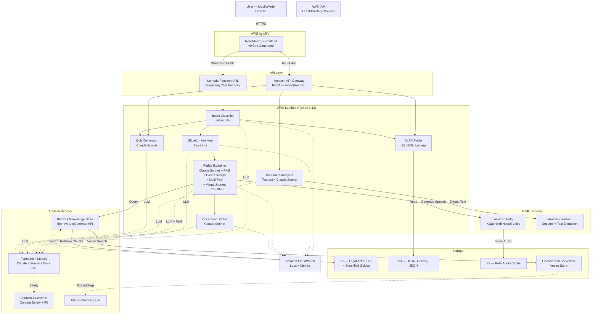
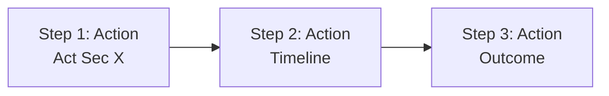

# Design Document: Nyaya Saathi

## Overview

Nyaya Saathi ("Justice Companion") is an AI-powered legal rights awareness, case strategy, and grievance drafting platform for marginalized communities in India. The system uses a serverless AWS architecture with 14 AWS services, implementing a RAG (Retrieval-Augmented Generation) pipeline over 15+ Indian legal acts to provide accurate, contextual legal guidance in Hindi and English.

The platform follows a multi-stage prompt chaining workflow: (1) Intent Classifier routes requests, (2) Situation Analyzer extracts structured facts, (3) Rights Explainer uses RAG to match situations to legal provisions and generates plain-language explanations with case strength assessment, multi-path legal comparison, visual legal journey maps, IPC→BNS dual citations, and Amazon Polly TTS audio, (4) Document Drafter creates formatted grievance documents, (5) Document Analyzer scans uploaded documents via Amazon Textract, (6) DLSA Finder locates free legal aid centers, and (7) Quiz Generator produces interactive legal awareness quizzes.

All processing happens in temporary sessions without storing PII. The React/Next.js frontend is hosted on AWS Amplify with streaming responses via Lambda Function URLs for a production-quality user experience.

---

## Architecture

### High-Level Architecture



### Architecture Rationale

- **Serverless-first:** Lambda + API Gateway + Amplify means zero infrastructure management, automatic scaling, and pay-per-use pricing — ideal for a hackathon prototype and future scaling to millions of users.
- **React/Next.js over Streamlit:** Professional, production-quality UI generated via v0/Bolt. React enables streaming display, Mermaid.js rendering, `@react-pdf/renderer` for PDF export, and rich interactive components (quiz cards, comparison cards, flowcharts) that Streamlit cannot support.
- **Amplify over EC2:** Managed CI/CD from GitHub, automatic SSL, CDN distribution, zero server management. No SSH debugging.
- **Lambda Function URLs for streaming:** API Gateway REST does not support response streaming. Lambda Function URLs enable word-by-word streaming (ChatGPT-style) via Bedrock's `converse_stream` API. API Gateway REST is still used for non-streaming endpoints (DLSA finder, document download, quiz).
- **Managed AI services:** Amazon Bedrock provides Claude Sonnet and Nova Lite without GPU management. Bedrock Knowledge Bases handle RAG automatically. Guardrails enforce content safety.
- **RAG over fine-tuning:** Laws change — the IPC was replaced by BNS in July 2024. RAG allows instant updates by replacing a PDF in S3. Fine-tuning requires full retraining.
- **Microservices Lambda pattern:** 7 dedicated Lambda functions (Intent Classifier, Situation Analyzer, Rights Explainer, Document Drafter, Document Analyzer, DLSA Finder, Quiz Generator) enable independent scaling, cleaner testing, and modular prompt management.
- **Dual model strategy:** Nova Lite for cheap/fast classification and fact extraction; Claude Sonnet for high-quality reasoning, explanation, and document generation.

### Component Responsibilities

**Frontend Layer (React/Next.js on AWS Amplify)**
- Professional chat UI with streaming message display (word-by-word)
- Voice input via Web Speech API (browser-native, no AWS service needed)
- Audio playback for Polly TTS (🔊 सुनें button)
- Rights cards, IPC→BNS comparison cards, case strength progress bar
- Mermaid.js flowchart rendering for visual legal journey
- Multi-path comparison cards with recommendation badge
- Legal rights quiz interactive cards
- Side-by-side panel: raw legal text vs. AI explanation
- PDF export via `@react-pdf/renderer`
- Document upload for Textract scanning (camera input on mobile)
- Hindi/English toggle
- Disclaimer banner
- Session management (in-memory, no persistent storage)

**API Layer**
- *Lambda Function URL:* Streaming POST endpoint for chat (rights explanation with word-by-word delivery)
- *Amazon API Gateway (REST):* Non-streaming endpoints for DLSA finder, document analysis (Textract), quiz generation, document download

**Compute Layer (7 AWS Lambda Functions — Python 3.12)**
1. **Intent Classifier:** Routes requests to appropriate workflow using Nova Lite
2. **Situation Analyzer:** Extracts structured facts from user situation using Nova Lite
3. **Rights Explainer:** RAG retrieval + plain-language explanation + IPC→BNS mapping + case strength + multi-path comparison + visual journey + Polly TTS using Claude Sonnet
4. **Document Drafter:** Creates formatted grievance documents using Claude Sonnet
5. **Document Analyzer:** Extracts text via Textract + legal analysis via Claude Sonnet
6. **DLSA Finder:** Searches legal aid directory by location (S3 JSON lookup)
7. **Quiz Generator:** Generates legal awareness quiz questions using Claude Sonnet

**AI Layer (Amazon Bedrock)**
- *Foundation Models:* Claude 3 Sonnet (reasoning, explanation, documents) + Nova Lite (classification, extraction)
- *Knowledge Base:* Managed RAG with automatic chunking, Titan Embeddings V2, OpenSearch Serverless vector store
- *Guardrails:* Content filtering (hate, violence, sexual), denied topics (outcome prediction, illegal activity, medical/financial advice), PII blocking

**AI/ML Services**
- *Amazon Polly:* Hindi neural TTS with Kajal voice (hi-IN) for reading rights aloud
- *Amazon Textract:* OCR for uploaded legal document/notice images

**Storage Layer**
- *S3 Legal Corpus:* 15+ Indian legal act PDFs + simplified Hindi guides (Markdown)
- *S3 DLSA Directory:* JSON file with all-India district-wise legal aid center data
- *S3 Polly Audio:* Cached Polly audio files with pre-signed URL access
- *OpenSearch Serverless:* Vector embeddings for Knowledge Base semantic search

**Observability & Security**
- *CloudWatch:* Logs from all Lambda functions + custom metrics dashboard
- *IAM:* Least-privilege execution roles per Lambda function

### Data Flow — Streaming Chat (New Situation)

```
User                    React Frontend          Lambda Function URL    Bedrock/KB/Polly
 │                        │                           │                      │
 │  🎤 Hindi voice input  │                           │                      │
 │  OR typed text         │                           │                      │
 │───────────────────────>│                           │                      │
 │                        │  POST (streaming)         │                      │
 │                        │  {msg, session_id,        │                      │
 │                        │   lang: "hi"}             │                      │
 │                        │──────────────────────────>│                      │
 │                        │                           │                      │
 │                        │                           │  Stage 1: Intent     │
 │                        │                           │  Classify (Nova Lite)│
 │                        │                           │─────────────────────>│
 │                        │                           │  → "new_situation"   │
 │                        │                           │<─────────────────────│
 │                        │                           │                      │
 │                        │                           │  Stage 2: Situation  │
 │                        │                           │  Analyze (Nova Lite) │
 │                        │                           │─────────────────────>│
 │                        │                           │  → {category, facts} │
 │                        │                           │<─────────────────────│
 │                        │                           │                      │
 │                        │                           │  Stage 3: RAG Query  │
 │                        │                           │  (Knowledge Base)    │
 │                        │                           │─────────────────────>│
 │                        │                           │  → 10 legal chunks   │
 │                        │                           │<─────────────────────│
 │                        │                           │                      │
 │                        │                           │  Stage 4: Rights     │
 │                        │                           │  Explain (Sonnet     │
 │                        │                           │  converse_stream)    │
 │                        │  ◄─── streaming chunks ──│─────────────────────>│
 │  ◄─── word-by-word ───│                           │  ◄── stream ────────│
 │  display (typing       │                           │                      │
 │  effect)               │                           │                      │
 │                        │                           │                      │
 │                        │                           │  Stage 5: Polly TTS  │
 │                        │                           │  (async, after       │
 │                        │                           │  stream completes)   │
 │                        │                           │─────────────────────>│
 │                        │                           │  → S3 pre-signed URL │
 │                        │                           │<─────────────────────│
 │                        │                           │                      │
 │                        │  {audio_url, case_strength,│                     │
 │                        │   paths, mermaid_code,    │                      │
 │                        │   raw_chunks}             │                      │
 │                        │<──────────────────────────│                      │
 │                        │                           │                      │
 │  Complete UI renders:  │                           │                      │
 │  • Rights cards        │                           │                      │
 │  • IPC→BNS cards       │                           │                      │
 │  • Case strength bar   │                           │                      │
 │  • Mermaid flowchart   │                           │                      │
 │  • Multi-path cards    │                           │                      │
 │  • 🔊 Listen button    │                           │                      │
 │  • Show Source toggle  │                           │                      │
 │<───────────────────────│                           │                      │
```

### Data Flow — Document Scanning (Textract)

```
User                    React Frontend          API Gateway       Document Analyzer Lambda
 │                        │                        │                      │
 │  📸 Upload photo of    │                        │                      │
 │  legal notice          │                        │                      │
 │───────────────────────>│                        │                      │
 │                        │  POST /analyze-document│                      │
 │                        │  {image: base64}       │                      │
 │                        │───────────────────────>│                      │
 │                        │                        │──────────────────────>│
 │                        │                        │                      │
 │                        │                        │  1. Textract:         │
 │                        │                        │  detect_document_text │
 │                        │                        │  → extracted text     │
 │                        │                        │                      │
 │                        │                        │  2. Bedrock (Sonnet): │
 │                        │                        │  Analyze legal        │
 │                        │                        │  document in context  │
 │                        │                        │  → type, legitimacy,  │
 │                        │                        │    deadline, actions  │
 │                        │                        │                      │
 │                        │  {analysis}            │                      │
 │                        │<───────────────────────│<─────────────────────│
 │  Document analysis     │                        │                      │
 │  displayed with        │                        │                      │
 │  action steps          │                        │                      │
 │<───────────────────────│                        │                      │
```

---

## Components and Interfaces

### 1. React/Next.js Frontend (AWS Amplify)

**Purpose**: Professional, mobile-responsive web interface with streaming, voice, and interactive components.

**Key Components**:
- `ChatInterface` — Main chat with streaming message display
- `VoiceInput` — Web Speech API microphone button
- `RightsCard` — Expandable rights with IPC→BNS comparison
- `SideBySidePanel` — Raw legal text vs. AI explanation
- `CaseStrengthBar` — Progress bar + evidence checklist
- `LegalJourneyMap` — Mermaid.js flowchart renderer
- `MultiPathComparison` — Side-by-side legal path cards
- `DocumentPanel` — Generated document with Copy/Download PDF/Listen buttons
- `DocumentScanner` — File upload with camera capture for Textract
- `LegalQuiz` — Interactive True/False quiz cards
- `LanguageToggle` — Hindi/English switcher
- `DisclaimerBanner` — Fixed top disclaimer

**Voice Input Component:**
```jsx
const VoiceInput = ({ onTranscript, language = 'hi-IN' }) => {
  const [isListening, setIsListening] = useState(false);

  const startListening = () => {
    const SpeechRecognition = window.SpeechRecognition || window.webkitSpeechRecognition;
    if (!SpeechRecognition) return; // Graceful fallback — hide mic button

    const recognition = new SpeechRecognition();
    recognition.lang = language;
    recognition.interimResults = false;

    recognition.onstart = () => setIsListening(true);
    recognition.onend = () => setIsListening(false);
    recognition.onerror = () => setIsListening(false); // Silent fallback
    recognition.onresult = (event) => {
      onTranscript(event.results[0][0].transcript);
    };

    recognition.start();
  };

  return (
    <button
      onClick={startListening}
      className={`mic-btn ${isListening ? 'pulsing' : ''}`}
      aria-label="Voice input"
    >
      🎤
    </button>
  );
};
```

**Streaming Chat Display:**
```jsx
const StreamingChat = ({ endpoint }) => {
  const [messages, setMessages] = useState([]);
  const [streamingText, setStreamingText] = useState('');

  const sendMessage = async (userInput) => {
    setMessages(prev => [...prev, { role: 'user', content: userInput }]);

    const response = await fetch(endpoint, {
      method: 'POST',
      headers: { 'Content-Type': 'application/json' },
      body: JSON.stringify({
        session_id: sessionId,
        user_input: userInput,
        language: currentLanguage,
      }),
    });

    const reader = response.body.getReader();
    const decoder = new TextDecoder();
    let fullText = '';

    while (true) {
      const { done, value } = await reader.read();
      if (done) break;
      const chunk = decoder.decode(value, { stream: true });
      fullText += chunk;
      setStreamingText(fullText); // Word-by-word display
    }

    // After streaming completes, parse structured data (JSON block at end)
    const { text, metadata } = parseStreamedResponse(fullText);
    setMessages(prev => [
      ...prev,
      {
        role: 'assistant',
        content: text,
        caseStrength: metadata.case_strength,
        legalPaths: metadata.legal_paths,
        mermaidCode: metadata.mermaid_flowchart,
        rawChunks: metadata.raw_legal_chunks,
        audioUrl: metadata.polly_audio_url,
        ipcBnsMapping: metadata.ipc_bns_mapping,
      },
    ]);
    setStreamingText('');
  };

  return (/* chat UI with message bubbles, rights cards, etc. */);
};
```

**PDF Export Component:**
```jsx
import { PDFDownloadLink, Document, Page, Text, View, Font } from '@react-pdf/renderer';

// Register Devanagari font for Hindi support
Font.register({
  family: 'NotoSansDevanagari',
  src: '/fonts/NotoSansDevanagari-Regular.ttf',
});

const GrievancePDF = ({ document, metadata }) => (
  <Document>
    <Page style={styles.page}>
      <Text style={styles.header}>
        {metadata.type === 'rti' ? 'सूचना का अधिकार आवेदन / RTI Application' :
         metadata.type === 'fir' ? 'प्रथम सूचना रिपोर्ट / FIR Description' :
         metadata.type === 'complaint' ? 'शिकायत पत्र / Complaint Letter' :
         'कानूनी सहायता आवेदन / Legal Aid Application'}
      </Text>
      <Text style={styles.address}>{metadata.authority}</Text>
      <Text style={styles.date}>[DATE / दिनांक]</Text>
      <Text style={styles.body}>{document.body}</Text>
      <Text style={styles.signature}>[YOUR NAME / आपका नाम]</Text>
      <View style={styles.disclaimer}>
        <Text>यह मार्गदर्शन है, कानूनी सलाह नहीं। / This is guidance, not legal advice.</Text>
        <Text>Generated by Nyaya Saathi</Text>
      </View>
    </Page>
  </Document>
);

// Usage in document panel
<PDFDownloadLink document={<GrievancePDF {...props} />} fileName="complaint.pdf">
  {({ loading }) => loading ? 'Generating PDF...' : '📄 Download PDF'}
</PDFDownloadLink>
```

**Mermaid.js Legal Journey Renderer:**
```jsx
import mermaid from 'mermaid';
import { useEffect, useRef } from 'react';

const LegalJourneyMap = ({ mermaidCode }) => {
  const containerRef = useRef(null);

  useEffect(() => {
    if (!mermaidCode || !containerRef.current) return;
    mermaid.initialize({
      startOnLoad: false,
      theme: 'base',
      themeVariables: {
        primaryColor: '#2563eb',
        primaryTextColor: '#fff',
        lineColor: '#64748b',
      },
    });
    mermaid.render('legal-journey', mermaidCode).then(({ svg }) => {
      containerRef.current.innerHTML = svg;
    });
  }, [mermaidCode]);

  return (
    <div className="journey-map-container">
      <h3>📍 आपकी कानूनी यात्रा / Your Legal Journey</h3>
      <div ref={containerRef} />
    </div>
  );
};
```

**IPC → BNS Comparison Card:**
```jsx
const LawComparisonCard = ({ oldLaw, newLaw, explanation }) => (
  <div className="law-comparison-card">
    <div className="old-law-badge">
      <span className="badge amber">पुराना कानून / Old Law</span>
      <p className="law-ref">{oldLaw}</p>
    </div>
    <div className="arrow">→</div>
    <div className="new-law-badge">
      <span className="badge green">नया कानून / New Law</span>
      <p className="law-ref">{newLaw}</p>
    </div>
    <p className="law-explanation">{explanation}</p>
  </div>
);
```

**Case Strength Progress Bar:**
```jsx
const CaseStrengthCard = ({ strength }) => (
  <div className="case-strength-card">
    <h3>📊 Case Strength Assessment</h3>
    <div className="progress-bar">
      <div
        className="progress-fill"
        style={{ width: `${strength.score}%` }}
        data-label={strength.label}
      />
    </div>
    <p className="score-label">{strength.score}% — {strength.label}</p>

    <h4>✅ You have:</h4>
    <ul>{strength.has.map(item => <li key={item}>{item}</li>)}</ul>

    <h4>⚠️ Missing evidence:</h4>
    <ul>{strength.missing.map(item => <li key={item}>{item}</li>)}</ul>

    <h4>📋 Collect these:</h4>
    <ul>
      {strength.checklist.map(({ item, impact }) => (
        <li key={item}>□ {item} <span className="impact">{impact}</span></li>
      ))}
    </ul>
  </div>
);
```

**Multi-Path Comparison Cards:**
```jsx
const MultiPathComparison = ({ paths }) => (
  <div className="multi-path-grid">
    <h3>🔀 Legal Paths Available</h3>
    <div className="paths-container">
      {paths.map((path, i) => (
        <div key={i} className={`path-card ${path.recommended ? 'recommended' : ''}`}>
          {path.recommended && <span className="rec-badge">⭐ RECOMMENDED</span>}
          <h4>{path.name}</h4>
          <p><strong>Legal Basis:</strong> {path.legal_basis}</p>
          <p><strong>Timeline:</strong> {path.timeline}</p>
          <p><strong>Cost:</strong> {path.cost}</p>
          <p><strong>Difficulty:</strong> {'█'.repeat(path.difficulty)}{'░'.repeat(5 - path.difficulty)}</p>
          <p><strong>Likely Outcome:</strong> {path.outcome}</p>
          {path.combinable && <p className="combine-note">✅ Can be combined with other paths</p>}
        </div>
      ))}
    </div>
  </div>
);
```

**Side-by-Side Legal Text vs. Explanation:**
```jsx
const SideBySidePanel = ({ rawLegalText, explanation }) => (
  <div className="side-by-side-container">
    <div className="panel raw-text">
      <h4>📜 Original Legal Text</h4>
      <p>{rawLegalText}</p>
    </div>
    <div className="panel explanation">
      <h4>💡 Nyaya Saathi Explanation</h4>
      <p>{explanation}</p>
    </div>
  </div>
);
```

**Document Scanner (Textract Upload):**
```jsx
const DocumentScanner = ({ onAnalysis }) => {
  const [loading, setLoading] = useState(false);

  const handleUpload = async (e) => {
    const file = e.target.files[0];
    if (!file) return;
    setLoading(true);

    const formData = new FormData();
    formData.append('document', file);

    try {
      const res = await fetch('/api/analyze-document', {
        method: 'POST',
        body: formData,
      });
      const analysis = await res.json();
      onAnalysis(analysis);
    } catch (err) {
      onAnalysis({ error: 'Upload failed. Please try a clearer photo.' });
    } finally {
      setLoading(false);
    }
  };

  return (
    <label className="upload-zone">
      📸 Upload a legal notice, court order, or any document you received
      <input
        type="file"
        accept="image/*"
        capture="environment"
        onChange={handleUpload}
      />
      {loading && <span className="loading">Analyzing with Amazon Textract...</span>}
    </label>
  );
};
```

**Legal Rights Quiz:**
```jsx
const LegalQuiz = ({ questions, onNavigateToChat }) => {
  const [currentQ, setCurrentQ] = useState(0);
  const [score, setScore] = useState(0);
  const [showResult, setShowResult] = useState(false);
  const [answered, setAnswered] = useState(false);
  const [isCorrect, setIsCorrect] = useState(null);

  const handleAnswer = (answer) => {
    const correct = answer === questions[currentQ].correctAnswer;
    setIsCorrect(correct);
    setAnswered(true);
    if (correct) setScore(prev => prev + 1);
  };

  const nextQuestion = () => {
    if (currentQ + 1 >= questions.length) {
      setShowResult(true);
    } else {
      setCurrentQ(prev => prev + 1);
      setAnswered(false);
      setIsCorrect(null);
    }
  };

  if (showResult) {
    return (
      <div className="quiz-result">
        <h3>🎯 Your Score: {score}/{questions.length}</h3>
        <p>Explore topics where you scored poorly to learn more.</p>
      </div>
    );
  }

  return (
    <div className="quiz-card">
      <h3>🎯 Do You Know Your Rights? ({currentQ + 1}/{questions.length})</h3>
      <p className="question">{questions[currentQ].text}</p>
      {!answered ? (
        <div className="options">
          {questions[currentQ].options.map(opt => (
            <button key={opt} onClick={() => handleAnswer(opt)}>{opt}</button>
          ))}
        </div>
      ) : (
        <div className="explanation">
          <p>{isCorrect ? '✅ Correct!' : '❌ Wrong!'} {questions[currentQ].explanation}</p>
          <p className="citation">{questions[currentQ].actSection}</p>
          <button onClick={() => onNavigateToChat(questions[currentQ].topic)}>
            🔍 Tell Me More
          </button>
          <button onClick={() => onNavigateToChat(`Draft complaint: ${questions[currentQ].topic}`)}>
            📝 Draft Complaint
          </button>
          <button onClick={nextQuestion}>Next →</button>
        </div>
      )}
    </div>
  );
};
```

**Session State Structure (In-Memory):**
```javascript
// React state — never persisted to storage
const sessionState = {
  sessionId: 'uuid-v4',           // Unique per browser session
  language: 'hi',                  // 'hi' or 'en'
  conversationHistory: [           // {role, content, timestamp}
    { role: 'user', content: '...', timestamp: '...' },
    { role: 'assistant', content: '...', timestamp: '...',
      metadata: { /* case strength, paths, etc. */ } },
  ],
  currentSituation: null,          // Extracted facts from Situation Analyzer
  identifiedRights: [],            // Rights from Rights Explainer
};
```

**API Request/Response Formats:**
```typescript
// Chat request (to Lambda Function URL — streaming)
interface ChatRequest {
  session_id: string;
  user_input: string;
  language: 'hi' | 'en';
  conversation_history: Message[];
}

// Chat response (streamed text + JSON metadata block at end)
// Text streams word-by-word, then a final JSON block:
interface ChatMetadata {
  intent: string;
  sources: SourceCitation[];
  case_strength: CaseStrength;
  legal_paths: LegalPath[];
  mermaid_flowchart: string;         // Mermaid.js code
  ipc_bns_mapping: LawMapping[];
  raw_legal_chunks: string[];        // For side-by-side display
  polly_audio_url: string | null;    // S3 pre-signed URL
  suggested_actions: string[];
  confidence: number;
  disclaimer: string;
}

// Non-streaming endpoints (via API Gateway)
interface DocumentAnalysisRequest {
  image_base64: string;
}

interface DocumentAnalysisResponse {
  extracted_text: string;
  analysis: string;
  document_type: string;
  deadline: string | null;
  action_steps: string[];
}

interface QuizRequest {
  language: 'hi' | 'en';
  topic?: string;
}

interface QuizResponse {
  questions: QuizQuestion[];
}

interface DLSARequest {
  location: string;
}

interface DLSAResponse {
  centers: DLSACenter[];
}
```

---

### 2. Intent Classifier Lambda

**Purpose**: Classify user requests into workflow categories using Amazon Nova Lite.

**Input**:
```python
{
    "session_id": str,
    "user_input": str,
    "conversation_history": List[Dict],
    "language": str  # "hi" | "en"
}
```

**Output**:
```python
{
    "intent": str,  # new_situation | follow_up | document_request | document_scan |
                    # legal_aid_search | quiz | out_of_scope
    "confidence": float,
    "extracted_entities": Dict,  # {document_type, location, etc.}
    "clarification_needed": bool
}
```

**Intent Classification Table:**

| Intent | Trigger Examples | Action |
|--------|-----------------|--------|
| `new_situation` | "My husband beats me" / "Mera maalik paisa nahi de raha" | Full RAG pipeline |
| `follow_up` | "What if he threatens me?" / "Aur kya kar sakti hoon?" | Context-aware follow-up |
| `document_request` | "RTI likho" / "Draft a complaint" / "शिकायत पत्र लिखो" | Document generation |
| `document_scan` | "I received a notice" + image upload | Textract + legal analysis |
| `legal_aid_search` | "Nearest legal aid" / "Free vakil kahan milega?" | DLSA directory lookup |
| `quiz` | "Quiz" / "Test my rights knowledge" / "Know Your Rights" | Quiz generation |
| `out_of_scope` | "What's the weather?" / Medical/financial questions | Polite refusal |

**Prompt Template:**
```
System: You are an intent classifier for Nyaya Saathi, an Indian legal assistance 
system. Classify the user's request into one of these categories:

- new_situation: User describes a legal problem for the first time
- follow_up: User asks follow-up questions about previous response  
- document_request: User explicitly asks for document generation (RTI, FIR, complaint, 
  legal aid application). Look for: "likho", "draft", "write", "banao", "application"
- document_scan: User wants to upload/scan a document they received
- legal_aid_search: User asks for legal aid center / DLSA / free lawyer information
- quiz: User wants to take a legal awareness quiz or test their knowledge
- out_of_scope: Request is outside legal assistance scope

If confidence < 0.7, set clarification_needed to true.

User input: {user_input}
Conversation history (last 3 messages): {conversation_history}

Respond with JSON: {"intent": "...", "confidence": 0.0-1.0, 
"entities": {...}, "clarification_needed": false}
```

**Logic**:
- Use Amazon Bedrock Nova Lite (cheap, fast, <1 second)
- Few-shot examples for each intent type included in prompt
- Extract entities: document_type, location for DLSA
- If confidence < 0.7, return `clarification_needed: true`

---

### 3. Situation Analyzer Lambda

**Purpose**: Extract structured facts from user's situation description using Amazon Nova Lite.

**Input**:
```python
{
    "session_id": str,
    "user_input": str,
    "language": str
}
```

**Output**:
```python
{
    "situation_summary": str,    # Concise English summary for RAG query
    "extracted_facts": {
        "parties_involved": List[str],   # ["user", "husband", "in-laws"]
        "location": Optional[str],       # District/state if mentioned
        "issue_type": str,               # "domestic_violence", "wage_theft", etc.
        "timeline": Optional[str],       # When incident(s) occurred
        "specific_details": Dict,        # Issue-specific facts
        "urgency": str                   # "emergency" | "urgent" | "ongoing" | "past"
    },
    "language": str  # Original language for response generation
}
```

**Prompt Template — Situation Analyzer:**
```
System: You are a legal fact extractor for Nyaya Saathi, an Indian legal rights 
assistant. Given a person's description of their situation in any language 
(Hindi, English, or Hinglish), extract structured facts:

1. issue_type: One of [domestic_violence, dowry, wage_theft, discrimination, 
   consumer_complaint, rti_needed, property_dispute, child_rights, 
   senior_citizen, trafficking, other]
2. parties_involved: List of parties (user, husband, employer, landlord, police, etc.)
3. key_events: What happened, in chronological order
4. location: District/state if mentioned
5. timeline: When did this happen (dates, durations)
6. urgency: "emergency" (immediate danger), "urgent" (needs action within days), 
            "ongoing" (persistent problem), "past" (historical event)
7. evidence_mentioned: What evidence the user already has or mentions

Also generate a concise English summary (1-2 sentences) suitable for RAG 
retrieval query.

IMPORTANT: Do NOT add or assume facts not mentioned by the user.

Respond ONLY in structured JSON format.

User input: {user_input}
```

---

### 4. Rights Explainer Lambda (Extended)

**Purpose**: The core Lambda. Performs RAG retrieval, generates plain-language rights explanation, and produces extended outputs: case strength assessment, multi-path comparison, visual legal journey map, IPC→BNS mapping, and Amazon Polly TTS audio.

**Input**:
```python
{
    "session_id": str,
    "situation_summary": str,
    "extracted_facts": Dict,
    "language": str,
    "conversation_history": List[Dict]
}
```

**Output**:
```python
{
    "rights_explanation": str,           # Streamed, plain-language explanation
    "applicable_rights": List[{
        "act_name": str,
        "section": str,
        "old_law": Optional[str],        # IPC/CrPC reference (if criminal)
        "new_law": Optional[str],        # BNS/BNSS reference (if criminal)
        "provision_text": str,           # Simplified version
        "raw_legal_text": str,           # Original RAG chunk (for side-by-side)
        "relevance_score": float
    }],
    "case_strength": {
        "score": int,                    # 0-100
        "label": str,                    # Weak/Moderate/Strong/Very Strong
        "has": List[str],                # What user HAS
        "missing": List[str],            # What's MISSING
        "checklist": List[{              # Evidence to collect
            "item": str,
            "impact": str                # "+10%", "+5%", etc.
        }],
        "summary": str                   # Brief assessment text
    },
    "legal_paths": List[{
        "name": str,                     # "Criminal FIR", "Civil Protection Order"
        "legal_basis": str,              # "DV Act Sec 18-22"
        "timeline": str,                 # "3-60 days"
        "cost": str,                     # "Free"
        "difficulty": int,               # 1-5
        "outcome": str,                  # "Court-ordered protection"
        "recommended": bool,
        "combinable": bool
    }],
    "mermaid_flowchart": str,            # Mermaid.js code for visual journey
    "polly_audio_url": Optional[str],    # S3 pre-signed URL for TTS audio
    "actionable_steps": List[str],
    "confidence": float
}
```

**RAG Configuration**:
```python
class KnowledgeBaseConfig:
    s3_bucket = "nyaya-saathi-legal-corpus"
    embedding_model = "amazon.titan-embed-text-v2:0"
    vector_store = "opensearch_serverless"
    chunking_strategy = {
        "type": "fixed_size",
        "max_tokens": 1000,
        "overlap_percentage": 20
    }
    retrieval_config = {
        "top_k": 10,
        "reranking": True
    }
```

**Implementation — Rights Explanation with Streaming:**
```python
import boto3
import json

bedrock = boto3.client('bedrock-runtime', region_name='ap-south-1')
bedrock_agent = boto3.client('bedrock-agent-runtime', region_name='ap-south-1')
polly = boto3.client('polly', region_name='ap-south-1')
s3 = boto3.client('s3', region_name='ap-south-1')

KNOWLEDGE_BASE_ID = 'your-kb-id'
GUARDRAIL_ID = 'your-guardrail-id'

def handler(event, context):
    body = json.loads(event['body'])
    situation = body['situation_summary']
    facts = body['extracted_facts']
    language = body['language']

    # Step 1: RAG Retrieval
    rag_response = bedrock_agent.retrieve(
        knowledgeBaseId=KNOWLEDGE_BASE_ID,
        retrievalQuery={'text': situation},
        retrievalConfiguration={
            'vectorSearchConfiguration': {'numberOfResults': 10}
        }
    )
    
    raw_chunks = [
        r['content']['text'] for r in rag_response['retrievalResults']
    ]
    rag_context = '\n---\n'.join(raw_chunks)

    # Step 2: Stream rights explanation via converse_stream
    prompt = build_rights_prompt(situation, facts, rag_context, language)
    
    stream_response = bedrock.converse_stream(
        modelId='anthropic.claude-3-sonnet-20240229-v1:0',
        messages=[{"role": "user", "content": [{"text": prompt}]}],
        guardrailConfig={
            'guardrailIdentifier': GUARDRAIL_ID,
            'guardrailVersion': '1'
        }
    )

    # Stream text chunks back to client
    full_text = ''
    for event_chunk in stream_response['stream']:
        if 'contentBlockDelta' in event_chunk:
            text = event_chunk['contentBlockDelta']['delta']['text']
            full_text += text
            yield text  # Stream to Lambda Function URL response

    # Step 3: Generate structured metadata (case strength, paths, mermaid)
    metadata = generate_extended_outputs(situation, facts, full_text, 
                                          raw_chunks, language)

    # Step 4: Generate Polly TTS (async-ish, after explanation)
    audio_url = generate_polly_audio(metadata['summary_for_tts'], language)
    metadata['polly_audio_url'] = audio_url
    metadata['raw_legal_chunks'] = raw_chunks

    # Yield final JSON metadata block
    yield '\n---METADATA---\n' + json.dumps(metadata)
```

**Prompt Template — Rights Explainer (with RAG + Extended Outputs):**
```
System: You are Nyaya Saathi, a legal rights guide for marginalized communities 
in India. Based on the retrieved legal provisions and the user's situation:

PART 1 — RIGHTS EXPLANATION:
1. List all applicable legal rights (max 5 most relevant)
2. For each right, provide:
   - The right in one simple sentence (Class 8 Hindi reading level)
   - The specific Act name AND Section number
   - If it's a criminal provision, show BOTH old (IPC/CrPC) AND new (BNS/BNSS) 
     section numbers
   - One sentence explaining what this means practically
3. Provide step-by-step action guide (max 7 steps)

PART 2 — CASE STRENGTH ASSESSMENT:
Rate 0-100% based on: clarity of violation described, specificity of facts 
(dates, locations, actors), evidence mentioned or implied, number of applicable 
legal provisions.
- List what user HAS in their favor
- List what EVIDENCE is MISSING
- Generate prioritized evidence checklist (max 7 items) with impact percentage

PART 3 — MULTI-PATH COMPARISON:
Identify 2-4 distinct legal paths the user can take. For each:
- Name (e.g., "Criminal FIR", "Civil Protection Order", "DLSA Mediation")
- Legal basis (Act + Section)
- Expected timeline
- Cost to user (usually free for marginalized communities)
- Difficulty level (1-5)
- Likely outcome
- Whether it can be combined with other paths
Mark one as RECOMMENDED based on speed of relief + ease + effectiveness.

PART 4 — VISUAL LEGAL JOURNEY (Mermaid.js):
Generate a Mermaid.js flowchart showing the legal journey (4-6 steps):

Use {language_label} labels.

Rules:
- ALWAYS cite Act name and Section number from the retrieved context
- NEVER fabricate or invent legal provisions not in the retrieved context
- Use simple {language_name} vocabulary (Class 8 reading level)
- If unsure, say so — never guess legal provisions
- End with disclaimer
- For criminal provisions, ALWAYS show both old (IPC) and new (BNS) sections

Retrieved Legal Context:
{rag_context}

User Situation:
{situation_summary}

Extracted Facts:
{extracted_facts}

Output the rights explanation as natural text (this will be streamed).
Then output a JSON block with structured data for case_strength, legal_paths, 
and mermaid_flowchart.
```

**Amazon Polly TTS Integration:**
```python
def generate_polly_audio(text, language='hi-IN'):
    """Generate Hindi speech audio using Amazon Polly Kajal neural voice."""
    try:
        response = polly.synthesize_speech(
            Text=text[:3000],  # Polly limit
            OutputFormat='mp3',
            VoiceId='Kajal',
            Engine='neural',
            LanguageCode=language
        )
        
        # Upload to S3 with pre-signed URL
        audio_key = f"polly-audio/{uuid.uuid4()}.mp3"
        s3.put_object(
            Bucket='nyaya-saathi-audio',
            Key=audio_key,
            Body=response['AudioStream'].read(),
            ContentType='audio/mpeg'
        )
        
        # Generate pre-signed URL (1 hour expiry)
        url = s3.generate_presigned_url(
            'get_object',
            Params={'Bucket': 'nyaya-saathi-audio', 'Key': audio_key},
            ExpiresIn=3600
        )
        return url
    except Exception:
        return None  # Silent failure — frontend hides Listen button
```

---

### 5. Document Drafter Lambda

**Purpose**: Generate formatted legal documents based on situation and identified rights using Claude Sonnet.

**Input**:
```python
{
    "session_id": str,
    "document_type": str,  # "rti" | "fir" | "complaint" | "legal_aid_application"
    "situation_summary": str,
    "extracted_facts": Dict,
    "applicable_rights": List[Dict],
    "language": str
}
```

**Output**:
```python
{
    "document_text": str,
    "submission_instructions": List[str],
    "required_attachments": List[str],
    "authority_address": Optional[str]
}
```

**Prompt Template — Document Drafter:**
```
System: You are a legal document drafter for Nyaya Saathi. Draft a {document_type} 
in {language} for the following situation. Follow the standard format for 
{document_type} in India.

Include:
- Proper addressing (To: appropriate authority)
- Date placeholder: [DATE / दिनांक]
- Subject line
- Body with ALL relevant facts from the user's situation
- Specific Act & Section references (both IPC and BNS where applicable)
- Relief/information sought
- Placeholder markers: [YOUR NAME / आपका नाम], [YOUR ADDRESS / आपका पता], 
  [DATE / दिनांक], [AADHAAR NUMBER / आधार संख्या]
- Proper closing and signature block
- Disclaimer footer

After the document, provide:
1. Step-by-step submission instructions (where to go, what to carry, what to expect)
2. List of required attachments
3. Authority address/contact

Situation facts: {extracted_facts}
Applicable laws: {applicable_rights}

IMPORTANT: Generate the complete document text, not a template description.
```

**Document Templates Supported:**
- **RTI Application:** Standard format per RTI Act 2005, addressed to PIO
- **FIR Description:** Narrative format with IPC/BNS sections for police complaint
- **Complaint Letter:** Formal letter to District Collector, Labor Commissioner, Women's Commission, etc.
- **Legal Aid Application:** DLSA application form with eligibility justification per Legal Services Authorities Act

---

### 6. Document Analyzer Lambda (NEW — Amazon Textract)

**Purpose**: Extract text from uploaded document images and provide legal analysis.

**Input**:
```python
{
    "image_bytes": bytes,  # Document image (JPEG/PNG)
    "language": str
}
```

**Output**:
```python
{
    "extracted_text": str,
    "analysis": {
        "document_type": str,       # "court_notice", "legal_notice", "eviction_order", etc.
        "from_authority": str,      # Who sent it
        "is_legitimate": str,       # "yes" | "likely" | "uncertain" | "suspicious"
        "key_demands": str,         # What it asks the person to do
        "deadline": Optional[str],  # Response deadline
        "is_legally_binding": str,   # "yes" | "no" | "uncertain"
        "cited_provisions": List[str],
        "action_steps": List[str],  # What to do next, step by step
        "explanation": str          # Simple-language explanation
    }
}
```

**Implementation:**
```python
import boto3

textract = boto3.client('textract', region_name='ap-south-1')
bedrock = boto3.client('bedrock-runtime', region_name='ap-south-1')

def handler(event, context):
    image_bytes = base64.b64decode(event['body']['image_base64'])

    # Step 1: Extract text from image via Textract
    textract_response = textract.detect_document_text(
        Document={'Bytes': image_bytes}
    )
    
    extracted_text = ' '.join([
        block['Text'] for block in textract_response['Blocks']
        if block['BlockType'] == 'LINE'
    ])
    
    if not extracted_text.strip():
        return {
            'statusCode': 400,
            'body': json.dumps({
                'error': 'Could not extract text. Please try a clearer photo.'
            })
        }

    # Step 2: Legal analysis via Bedrock
    prompt = f"""You are a legal document analyst for India. A user has uploaded 
a document they received but cannot read or understand. Analyze it:

1. What type of document is this? (court notice, legal notice, eviction order, 
   challan, FIR copy, summons, recovery notice, etc.)
2. Who sent it? Is it from a legitimate authority?
3. What is it asking the person to do?
4. What is the deadline to respond (if any)?
5. Is it legally binding, or just an intimidation tactic?
6. What should the person do next — step by step
7. Which legal provisions are cited and what they mean in simple language

Respond in simple {"Hindi (Class 8 level)" if event.get('language') == 'hi' 
else "English"}.

IMPORTANT: If you cannot determine authenticity, say so clearly and recommend 
consulting a lawyer or DLSA.

Document text:
{extracted_text}"""
    
    response = bedrock.converse(
        modelId='anthropic.claude-3-sonnet-20240229-v1:0',
        messages=[{"role": "user", "content": [{"text": prompt}]}],
        guardrailConfig={
            'guardrailIdentifier': GUARDRAIL_ID,
            'guardrailVersion': '1'
        }
    )
    
    analysis = response['output']['message']['content'][0]['text']
    
    return {
        'statusCode': 200,
        'body': json.dumps({
            'extracted_text': extracted_text,
            'analysis': analysis
        })
    }
```

---

### 7. DLSA Finder Lambda

**Purpose**: Search free legal aid directory by user's location.

**Input**:
```python
{
    "location": str,     # District or state name (Hindi or English)
    "max_results": int   # Default 3
}
```

**Output**:
```python
{
    "centers": List[{
        "name": str,
        "district": str,
        "state": str,
        "address": str,
        "phone": str,
        "email": Optional[str]
    }],
    "eligibility_info": str  # Who qualifies for free legal aid
}
```

**Logic**:
- Load DLSA directory JSON from S3 (cached in Lambda memory across invocations)
- Fuzzy match location against district/state names (handle Hindi input, spelling variations)
- Return up to 3 nearest centers sorted by relevance
- If no match, return state-level SLSA contact
- Always include eligibility information (women, SC/ST, disabilities, workers, etc.)

**DLSA Directory Structure (S3 JSON):**
```json
{
    "districts": [
        {
            "state": "Uttar Pradesh",
            "state_hi": "उत्तर प्रदेश",
            "district": "Lucknow",
            "district_hi": "लखनऊ",
            "dlsa_name": "District Legal Services Authority, Lucknow",
            "address": "...",
            "phone": "...",
            "email": "..."
        }
    ]
}
```

---

### 8. Quiz Generator Lambda

**Purpose**: Generate interactive legal awareness quiz questions using Claude Sonnet.

**Input**:
```python
{
    "language": str,     # "hi" | "en"
    "topic": Optional[str]  # Specific topic, or None for general
}
```

**Output**:
```python
{
    "questions": List[{
        "text": str,           # Question text
        "text_hi": str,        # Hindi version
        "options": List[str],  # ["Yes", "No"] or ["True", "False"]
        "correctAnswer": str,
        "explanation": str,    # Why this is the answer
        "actSection": str,     # Legal citation
        "topic": str           # For "Tell Me More" navigation
    }]
}
```

**Prompt Template — Quiz Generator:**
```
System: Generate 5 True/False or Yes/No legal awareness questions for Indian 
citizens, focusing on rights most marginalized communities don't know about.

Topics to cover:
- Women's rights (DV Act, maternity, equal pay)
- Worker rights (MGNREGA, minimum wages, wrongful termination)
- Consumer rights (Consumer Protection Act 2019)
- Right to Information (RTI Act)
- Free legal aid (Legal Services Authorities Act)
- SC/ST protections (Prevention of Atrocities Act)

For each question:
1. Ask something most people would get WRONG (common misconceptions)
2. Provide the correct answer
3. Explain why, citing the specific Act and Section
4. Provide both Hindi and English text

Output as JSON array.

Language preference: {language}
{topic_instruction}
```

---

## Knowledge Base Design

### Data Source

Indian legal acts sourced from [indiacode.nic.in](https://www.indiacode.nic.in/) (government public domain). Simplified Hindi guides hand-curated for better RAG retrieval.

### S3 Bucket Structure

```
s3://nyaya-saathi-legal-corpus/
├── acts/
│   ├── ipc-bharatiya-nyaya-sanhita.pdf
│   ├── crpc-bharatiya-nagarik-suraksha-sanhita.pdf
│   ├── evidence-act-bharatiya-sakshya-adhiniyam.pdf
│   ├── domestic-violence-act-2005.pdf
│   ├── dowry-prohibition-act-1961.pdf
│   ├── sc-st-atrocities-act-1989.pdf
│   ├── rti-act-2005.pdf
│   ├── mgnrega-act-2005.pdf
│   ├── consumer-protection-act-2019.pdf
│   ├── motor-vehicles-act-1988.pdf
│   ├── payment-of-wages-act-1936.pdf
│   ├── minimum-wages-act-1948.pdf
│   ├── senior-citizens-act-2007.pdf
│   ├── pocso-act-2012.pdf
│   ├── rte-act-2009.pdf
│   ├── legal-services-authorities-act-1987.pdf
│   ├── maternity-benefit-act-1961.pdf
│   └── prohibition-of-child-marriage-act-2006.pdf
├── simplified-guides/
│   ├── domestic-violence-rights-hindi.md
│   ├── labor-rights-hindi.md
│   ├── rti-guide-hindi.md
│   ├── consumer-rights-hindi.md
│   ├── free-legal-aid-guide-hindi.md
│   ├── ipc-to-bns-mapping.md          # IPC→BNS section mapping reference
│   └── crpc-to-bnss-mapping.md        # CrPC→BNSS section mapping reference
├── dlsa-directory/
│   └── dlsa-all-india.json
└── polly-audio/                        # Generated Polly audio files (temporary)
```

### Knowledge Base Configuration

```python
kb_config = {
    "s3_bucket": "nyaya-saathi-legal-corpus",
    "data_sources": ["acts/", "simplified-guides/"],
    "embedding_model": "amazon.titan-embed-text-v2:0",
    "vector_store": {
        "type": "opensearch_serverless",
        "collection_name": "nyaya-saathi-legal-vectors"
    },
    "chunking_strategy": {
        "type": "fixed_size",
        "max_tokens": 1000,
        "overlap_percentage": 20
    },
    "retrieval": {
        "top_k": 10,
        "reranking": True
    }
}
```

### Design Rationale

- **Acts as PDFs:** Legal acts available as PDFs from indiacode.nic.in — direct upload, no preprocessing.
- **Simplified guides as Markdown:** Hand-curated plain-language IPC→BNS mappings and rights summaries in Hindi. These are "easy retrieval targets" — when RAG searches for domestic violence rights, it finds both the raw legal text AND the simplified Hindi guide, improving explanation quality.
- **IPC→BNS mapping file:** Dedicated Markdown file mapping old IPC/CrPC sections to new BNS/BNSS sections, ensuring accurate dual-citation.
- **Chunk size (1000 tokens, 20% overlap):** Optimized for legal act sections which are paragraph-length; overlap prevents cutting mid-provision.
- **Top-k = 10 with reranking:** Retrieves more chunks for comprehensive coverage, then reranks for relevance.

---

## Technology Stack Summary

| Layer | Technology | Justification |
|-------|-----------|---------------|
| **Frontend** | React/Next.js (v0/Bolt generated) | Professional UI, streaming support, Mermaid.js, PDF export, interactive components |
| **Hosting** | AWS Amplify | Managed CI/CD from GitHub, automatic SSL, CDN, zero server management |
| **Streaming API** | Lambda Function URLs | Supports response streaming (API Gateway REST does not) |
| **REST API** | Amazon API Gateway | Non-streaming endpoints (DLSA, Textract, quiz), throttling, CORS |
| **Compute** | AWS Lambda (Python 3.12) | Serverless, auto-scaling, pay-per-invocation, 120s timeout for Bedrock calls |
| **LLM** | Amazon Bedrock (Claude 3 Sonnet + Nova Lite) | Managed LLM, no GPU management, strong Hindi, dual model strategy |
| **RAG** | Amazon Bedrock Knowledge Bases | Managed RAG — automatic chunking, embedding, retrieval |
| **Guardrails** | Amazon Bedrock Guardrails | Content filtering, denied topics, PII blocking |
| **Embeddings** | Amazon Titan Embeddings V2 | Optimized for Bedrock KB, strong multilingual quality |
| **Vector DB** | Amazon OpenSearch Serverless | Auto-provisioned by Bedrock KB, serverless |
| **TTS** | Amazon Polly (Kajal neural, hi-IN) | Natural Hindi text-to-speech for illiterate users |
| **OCR** | Amazon Textract | Document text extraction from uploaded images |
| **Storage** | Amazon S3 | Legal PDFs, DLSA directory, Polly audio cache |
| **Monitoring** | Amazon CloudWatch | Logging, metrics, dashboard |
| **Security** | AWS IAM | Least-privilege access policies per Lambda |
| **Dev Tool** | Kiro | Spec-driven development workflow (explicitly in hackathon rubric) |
| **PDF Export** | @react-pdf/renderer | Client-side PDF generation with Devanagari font support |
| **Flowcharts** | Mermaid.js | In-browser flowchart rendering for visual legal journey |
| **Voice Input** | Web Speech API (browser-native) | Hindi/English speech-to-text, no AWS service needed |

---

## Data Models

### Session State (In-Memory Only — Never Persisted)

```python
class Session:
    session_id: str              # UUID
    created_at: datetime
    last_activity: datetime
    language: str                # "hi" | "en"
    conversation_history: List[Message]
    current_situation: Optional[SituationContext]
    identified_rights: List[LegalRight]

class Message:
    role: str                    # "user" | "assistant"
    content: str
    timestamp: datetime
    metadata: Optional[ResponseMetadata]

class ResponseMetadata:
    intent: str
    sources: List[SourceCitation]
    case_strength: Optional[CaseStrength]
    legal_paths: Optional[List[LegalPath]]
    mermaid_flowchart: Optional[str]
    polly_audio_url: Optional[str]
    raw_legal_chunks: Optional[List[str]]
    ipc_bns_mapping: Optional[List[LawMapping]]

class SituationContext:
    summary: str
    facts: Dict
    issue_type: str
    location: Optional[str]
    urgency: str
```

### Extended Data Models (New Features)

```python
class CaseStrength:
    score: int                   # 0-100
    label: str                   # "Weak" | "Moderate" | "Strong" | "Very Strong"
    has: List[str]               # Strengths user has
    missing: List[str]           # Missing evidence
    checklist: List[EvidenceItem]
    summary: str                 # Brief assessment text
    summary_for_tts: str         # Simplified version for Polly

class EvidenceItem:
    item: str                    # "Photos of injuries with date stamp"
    impact: str                  # "+10%"

class LegalPath:
    name: str                    # "Criminal FIR"
    legal_basis: str             # "IPC 498A / BNS 85-86"
    timeline: str                # "1-3 years"
    cost: str                    # "Free"
    difficulty: int              # 1-5
    outcome: str                 # "Arrest + trial"
    recommended: bool
    combinable: bool
    pros: List[str]
    cons: List[str]

class LawMapping:
    old_law: str                 # "IPC Section 498A"
    new_law: str                 # "BNS Section 85-86"
    act_type: str                # "criminal" | "procedural" | "evidence"
    explanation: str             # What it covers
    key_changes: Optional[str]   # Substantive differences if any

class QuizQuestion:
    text: str                    # English question
    text_hi: str                 # Hindi question
    options: List[str]           # ["Yes", "No"] or ["True", "False"]
    correct_answer: str
    explanation: str
    act_section: str             # "Maternity Benefit Act, Section 12"
    topic: str                   # For navigation to main chat

class DocumentAnalysis:
    extracted_text: str          # Raw OCR text from Textract
    document_type: str           # "court_notice", "legal_notice", etc.
    from_authority: str
    is_legitimate: str           # "yes" | "likely" | "uncertain" | "suspicious"
    key_demands: str
    deadline: Optional[str]
    is_legally_binding: str
    cited_provisions: List[str]
    action_steps: List[str]
    explanation: str             # Simple-language full explanation
```

### Legal Knowledge Base Document Metadata

```python
class LegalDocument:
    act_name: str                # "Indian Penal Code"
    act_name_new: Optional[str]  # "Bharatiya Nyaya Sanhita" (if replaced)
    act_year: int                # 1860
    act_year_new: Optional[int]  # 2023
    section_number: str          # "Section 498A"
    section_number_new: Optional[str]  # "Section 85-86" (BNS equivalent)
    content: str                 # Full text of section
    keywords: List[str]
    language: str                # "en" (source documents)
    is_replaced: bool            # True for IPC/CrPC/Evidence Act
```

### API Models

```python
class SourceCitation:
    act_name: str
    section: str
    old_law: Optional[str]       # IPC/CrPC reference
    new_law: Optional[str]       # BNS/BNSS reference
    relevance_score: float

class DLSACenter:
    name: str
    district: str
    state: str
    address: str
    phone: str
    email: Optional[str]
```

---

## Security & Privacy Design

### Data Flow Security
- **In transit:** All API calls over HTTPS/TLS 1.2+
- **At rest:** S3 default encryption (AES-256) for legal corpus and Polly audio
- **No PII storage:** Conversations are session-scoped in React state — never persisted to any database, S3, or logs
- **No authentication by design:** Anonymous access is a deliberate safety feature — a woman using her abuser's phone cannot leave a login trail
- **Polly audio expiry:** Pre-signed S3 URLs expire after 1 hour — audio is not permanently accessible

### Amazon Bedrock Guardrails Configuration
```python
guardrails_config = {
    "guardrail_identifier": "nyaya-saathi-guardrail",
    "denied_topics": [
        {
            "name": "Case Outcome Prediction",
            "definition": "Predicting specific case outcomes, sentencing, or court decisions",
            "examples": ["Will I win my case?", "What sentence will he get?"]
        },
        {
            "name": "Encouraging Illegal Activity",
            "definition": "Providing guidance on how to commit crimes or evade law",
            "examples": ["How to file a false FIR", "How to hide evidence"]
        },
        {
            "name": "Medical or Financial Advice",
            "definition": "Providing medical diagnoses, treatment, financial planning, or investment advice",
            "examples": ["What medicine should I take?", "Where should I invest?"]
        }
    ],
    "content_filters": {
        "hate_speech": "BLOCK",
        "violence_glorification": "BLOCK",
        "sexual_content": "BLOCK",
        "insults": "LOW"  # Allow firm language discussing legal situations
    },
    "sensitive_info_filters": {
        "pii_types": ["AADHAAR_NUMBER", "PHONE_NUMBER", "EMAIL"],
        "action": "BLOCK"  # Block PII in AI responses
    }
}
```

### AI Safety Controls
- **System prompt hardening:** All prompts include instructions to refuse harmful/illegal guidance and to never fabricate legal provisions
- **Source attribution mandate:** LLM is instructed to ONLY cite Act & Section from retrieved RAG context; never invent
- **Confidence thresholds:** If RAG retrieval score < 0.6, system responds with "I'm not confident — please consult a legal aid center"
- **Input sanitization:** Lambda validates input length (max 2,000 chars), strips HTML/scripts, rejects empty inputs
- **Emergency detection:** System prompt instructs immediate emergency contact provision for life-threatening situations before any legal analysis

### IAM Least Privilege Policies

```python
# Each Lambda has its own role with minimum permissions
iam_policies = {
    "intent_classifier": [
        "bedrock:InvokeModel"  # Nova Lite only
    ],
    "situation_analyzer": [
        "bedrock:InvokeModel"  # Nova Lite only
    ],
    "rights_explainer": [
        "bedrock:InvokeModel",           # Claude Sonnet
        "bedrock:InvokeModelWithResponseStream",  # Streaming
        "bedrock:Retrieve",              # Knowledge Base
        "polly:SynthesizeSpeech",        # TTS
        "s3:PutObject",                  # Polly audio upload
        "s3:GetObject"                   # Pre-signed URL generation
    ],
    "document_drafter": [
        "bedrock:InvokeModel"  # Claude Sonnet
    ],
    "document_analyzer": [
        "bedrock:InvokeModel",  # Claude Sonnet
        "textract:DetectDocumentText"
    ],
    "dlsa_finder": [
        "s3:GetObject"  # DLSA directory only
    ],
    "quiz_generator": [
        "bedrock:InvokeModel"  # Claude Sonnet
    ]
}
```

---

## Correctness Properties

A property is a characteristic or behavior that should hold true across all valid executions of the system — a formal statement about what the system should do. Properties serve as the bridge between human-readable specifications and machine-verifiable correctness guarantees.

### Property 1: Multilingual Input Processing
*For any* user input in Hindi, English, or Hinglish (mixed Hindi-English), the System should successfully process the input and return a valid response without language-related errors.
**Validates: Requirements 1.1, 1.2, 1.3**

### Property 2: Intent Classification — New Situation
*For any* user request that describes a new legal situation, the Intent Classifier should classify it as `new_situation` with confidence above threshold.
**Validates: Requirement 2.1**

### Property 3: Intent Classification — Follow-up
*For any* follow-up question asked in the context of a previous conversation, the Intent Classifier should classify it as `follow_up`.
**Validates: Requirement 2.2**

### Property 4: Intent Classification — Document Request
*For any* explicit request for document generation (RTI, FIR, complaint, legal aid application), the Intent Classifier should classify it as `document_request`.
**Validates: Requirement 2.3**

### Property 5: Intent Classification — Document Scan
*For any* request involving an uploaded document image for analysis, the Intent Classifier should classify it as `document_scan`.
**Validates: Requirement 2.4**

### Property 6: Intent Classification — Legal Aid Search
*For any* request for legal aid center information, the Intent Classifier should classify it as `legal_aid_search`.
**Validates: Requirement 2.5**

### Property 7: Intent Classification — Quiz
*For any* request to take a legal awareness quiz, the Intent Classifier should classify it as `quiz`.
**Validates: Requirement 2.6**

### Property 8: Intent Classification — Out-of-Scope
*For any* request outside legal assistance scope (medical, financial, personal), the Intent Classifier should classify it as `out_of_scope`.
**Validates: Requirement 2.7**

### Property 9: Low Confidence Clarification
*For any* intent classification with confidence below threshold (0.7), the System should request clarifying questions from the user rather than making assumptions.
**Validates: Requirement 2.8**

### Property 10: RAG Retrieval Invocation
*For any* user situation description classified as `new_situation`, the Rights Explainer should query the Knowledge Base using RAG to retrieve relevant legal provisions.
**Validates: Requirement 3.1**

### Property 11: Comprehensive Legal Act Search
*For any* RAG retrieval query, the System should search across all 15+ Indian legal acts in the Knowledge Base without artificially limiting to specific acts.
**Validates: Requirement 3.3**

### Property 12: Multiple Act Retrieval
*For any* situation involving multiple legal domains (e.g., domestic violence + criminal law), the System should return provisions from all applicable acts.
**Validates: Requirement 3.4**

### Property 13: Source Attribution Completeness
*For any* rights explanation or generated document, all cited legal provisions should include both the specific Act name and Section number.
**Validates: Requirements 3.5, 4.5, 5.5, 14.1, 14.2, 14.3, 14.5**

### Property 14: DLSA Referral on Low Confidence
*For any* RAG retrieval, intent classification, or processing stage with confidence below threshold, the System should include uncertainty indicators and suggest DLSA consultation.
**Validates: Requirements 3.7, 9.5, 13.6, 24.7**

### Property 15: Reading Level Appropriateness
*For any* generated rights explanation in Hindi or English, the text should use vocabulary appropriate for Class 8 education level.
**Validates: Requirement 4.1**

### Property 16: Hindi Vocabulary Simplicity
*For any* rights explanation generated in Hindi, the text should avoid English legal jargon and use simple Hindi vocabulary.
**Validates: Requirement 4.2**

### Property 17: Multi-Right Organization
*For any* situation where multiple rights apply, the rights explanation should include clear section headings and numbered points.
**Validates: Requirement 4.4**

### Property 18: Universal Disclaimer Inclusion
*For any* generated response (rights explanation, document, error message), the output should include the disclaimer in both Hindi and English.
**Validates: Requirements 4.6, 5.8, 9.6**

### Property 19: Three-Aspect Right Explanation
*For any* individual right in a rights explanation, the System should cover: what the right means practically, what the user can do about it, and what protection it offers.
**Validates: Requirement 4.7**

### Property 20: RTI Application Format Compliance
*For any* RTI application generation request, the System should produce a document following the standard RTI Act 2005 format with proper addressing, subject, and information sought.
**Validates: Requirement 5.1**

### Property 21: FIR Description with Legal Sections
*For any* FIR description generation request, the System should include relevant IPC/BNS sections in the narrative.
**Validates: Requirement 5.2**

### Property 22: Formal Complaint Letter Structure
*For any* complaint letter generation request, the System should produce a formally structured letter with proper addressing, body, and closing.
**Validates: Requirement 5.3**

### Property 23: Legal Aid Application Format
*For any* legal aid application generation request, the System should produce a document matching DLSA application requirements.
**Validates: Requirement 5.4**

### Property 24: Fact Inclusion in Documents
*For any* generated grievance document, all relevant facts from the user's situation should appear in the document text.
**Validates: Requirement 5.5**

### Property 25: Document Submission Instructions
*For any* generated grievance document, the System should provide step-by-step submission instructions specific to that document type.
**Validates: Requirement 5.7**

### Property 26: DLSA Directory Query with Location
*For any* legal aid search request, the System should use the user's provided location in the DLSA directory query.
**Validates: Requirement 7.2**

### Property 27: DLSA Center Information Completeness
*For any* DLSA center returned in search results, the result should include name, address, and phone number at minimum.
**Validates: Requirement 7.4**

### Property 28: DLSA Result Limit
*For any* legal aid search, the System should return at most 3 nearest centers.
**Validates: Requirement 7.4**

### Property 29: Location Request on Missing Data
*For any* legal aid search request without location information, the System should ask the user for their district or state.
**Validates: Requirement 7.3**

### Property 30: Workflow Stage Ordering
*For any* `new_situation` intent, the System should execute stages in order: Intent Classifier → Situation Analyzer → Rights Explainer (with RAG + extended outputs).
**Validates: Requirements 8.1, 8.2**

### Property 31: Document Drafter Context Usage
*For any* Document Drafter execution, the generated document should incorporate context from previous stages (situation facts and identified rights).
**Validates: Requirement 8.4**

### Property 32: Illegal Activity Refusal
*For any* request seeking guidance on illegal activities, the System should refuse and explain it cannot assist.
**Validates: Requirement 9.1**

### Property 33: Outcome Prediction Refusal
*For any* request asking for case outcome predictions or guarantees, the System should refuse.
**Validates: Requirement 9.2**

### Property 34: Community Fairness
*For any* two similar legal situations differing only in community identity (SC/ST, women, workers, minorities), the System should provide responses of similar quality and completeness.
**Validates: Requirement 9.3**

### Property 35: Emergency Contact Provision
*For any* situation indicating immediate safety risk (active violence, threats, child abuse), the System should provide emergency contact information (100, 181, 1098) before legal analysis.
**Validates: Requirement 9.4**

### Property 36: Bedrock Guardrails Application
*For any* Bedrock LLM invocation, the System should apply Amazon Bedrock Guardrails with configured denied topics, content filters, and PII blocking.
**Validates: Requirement 9.8**

### Property 37: Guardrails Block User-Friendly Message
*For any* response blocked by Bedrock Guardrails, the System should display a user-friendly message (not a raw error) explaining the request cannot be processed.
**Validates: Requirement 9.9**

### Property 38: Session Creation
*For any* new user conversation, the System should create a temporary Session with a unique session_id.
**Validates: Requirement 10.1**

### Property 39: Conversation Context Maintenance
*For any* follow-up question within an active Session, the System should have access to previous conversation context.
**Validates: Requirement 10.2**

### Property 40: Session Data Deletion
*For any* Session that ends (timeout or close), all conversation data should be deleted from memory.
**Validates: Requirement 10.3**

### Property 41: PII Non-Persistence
*For any* system operation, PII (names, addresses, phone numbers, Aadhaar numbers, case details) should not be written to persistent storage.
**Validates: Requirements 10.4, 10.5**

### Property 42: Streaming Response Initiation
*For any* rights identification request, the System should begin streaming the response within 3 seconds.
**Validates: Requirement 12.1**

### Property 43: Rights Identification Completion Time
*For any* rights identification request, the System should complete the full response within 15 seconds.
**Validates: Requirement 12.1**

### Property 44: Document Generation Response Time
*For any* document generation request, the System should return the document within 30 seconds.
**Validates: Requirement 12.2**

### Property 45: Legal Aid Search Response Time
*For any* legal aid center query, the System should return results within 5 seconds.
**Validates: Requirement 12.3**

### Property 46: Polly Audio Generation Time
*For any* Polly TTS request, the System should return the audio URL within 5 seconds.
**Validates: Requirement 12.5**

### Property 47: Textract Processing Time
*For any* uploaded document image, Textract should return extracted text and analysis within 15 seconds.
**Validates: Requirement 12.6**

### Property 48: LLM Unavailability Error Handling
*For any* LLM service unavailability, the System should display an error message in the user's language without exposing technical details.
**Validates: Requirement 13.1**

### Property 49: Voice Input Fallback
*For any* Web Speech API failure, the System should silently fall back to text input mode.
**Validates: Requirements 13.7, 16.5**

### Property 50: Streaming Fallback
*For any* streaming response failure, the System should display the full response at once without the user noticing.
**Validates: Requirements 13.8, 18.4**

### Property 51: Polly TTS Fallback
*For any* Polly TTS failure, the System should display the text response normally and hide the Listen button.
**Validates: Requirements 13.9, 17.7**

### Property 52: Textract Fallback
*For any* Textract text extraction failure, the System should ask the user to try a clearer photo or type the document text manually.
**Validates: Requirements 13.10, 19.7**

### Property 53: Document Generation Fallback
*For any* document generation failure, the System should provide a template outline that the user can fill manually.
**Validates: Requirement 13.3**

### Property 54: Error Logging Without Exposure
*For any* system error, the error should be logged for debugging without exposing technical details to the user.
**Validates: Requirement 13.4**

### Property 55: Multiple Source Citation
*For any* legal right supported by multiple sources, the System should list all applicable sources.
**Validates: Requirement 14.4**

### Property 56: RAG Grounding
*For any* rights explanation, the System should only present information grounded in retrieved legal text — no hallucinated sections.
**Validates: Requirement 14.6**

### Property 57: IPC→BNS Dual Citation
*For any* criminal provision cited, the System should display both the old law reference (IPC/CrPC) and the new law reference (BNS/BNSS).
**Validates: Requirements 14.7, 23.1**

### Property 58: IPC→BNS Visual Card
*For any* dual citation, the System should render a comparison card with old law (amber) and new law (green) badges.
**Validates: Requirement 23.2**

### Property 59: Non-Criminal Normal Citation
*For any* non-criminal provision (RTI, MGNREGA, Consumer Protection Act, etc.), the System should cite normally without dual-citation format.
**Validates: Requirement 23.4**

### Property 60: Voice Input Language Support
*For any* voice input activation, the Web Speech API should support Hindi (hi-IN) and English (en-IN).
**Validates: Requirements 16.2, 16.3**

### Property 61: Voice Input Visual Indicator
*For any* active voice recording, the System should display a pulsing microphone icon.
**Validates: Requirement 16.6**

### Property 62: Polly Hindi Kajal Voice
*For any* Hindi speech generation, the System should use the Kajal neural voice (hi-IN).
**Validates: Requirement 17.2**

### Property 63: Polly Audio Playback Controls
*For any* Polly-generated audio, the System should provide play, pause, and stop controls.
**Validates: Requirement 17.5**

### Property 64: Case Strength Score Range
*For any* case strength assessment, the score should be between 0-100% with a corresponding label (Weak/Moderate/Strong/Very Strong).
**Validates: Requirement 24.3**

### Property 65: Case Strength Evidence Checklist
*For any* case strength assessment, the System should generate a prioritized evidence checklist (max 7 items) with estimated impact percentages.
**Validates: Requirement 24.5**

### Property 66: Low Case Strength DLSA Referral
*For any* case strength below 50%, the System should recommend DLSA professional guidance.
**Validates: Requirement 24.7**

### Property 67: Multi-Path Identification
*For any* new situation, the System should identify 2-4 distinct legal paths with name, legal basis, timeline, cost, difficulty, and outcome.
**Validates: Requirement 25.2**

### Property 68: Multi-Path Recommendation
*For any* multi-path comparison, the System should mark one path as RECOMMENDED based on speed, ease, and effectiveness.
**Validates: Requirement 25.3**

### Property 69: Visual Journey Step Count
*For any* visual legal journey, the Mermaid.js flowchart should include 4-6 steps with applicable Act/Section and timeline.
**Validates: Requirements 22.2, 22.3**

### Property 70: Visual Journey Language
*For any* visual legal journey when the user's language is Hindi, flowchart labels should be in Hindi.
**Validates: Requirement 22.5**

### Property 71: Side-by-Side Raw Legal Text
*For any* rights card with a "Show Source" toggle, clicking it should display the original legal text chunk alongside the simplified explanation.
**Validates: Requirements 21.2, 21.3**

### Property 72: PDF Document Format
*For any* PDF export, the document should include header, addressing, date placeholder, body, signature block, and disclaimer footer.
**Validates: Requirements 20.3, 20.4**

### Property 73: Quiz Question Generation
*For any* quiz generation, the System should produce 5 True/False or Yes/No questions with correct answer, explanation, and Act/Section citation.
**Validates: Requirements 26.1, 26.3**

### Property 74: Quiz Navigation Buttons
*For any* answered quiz question, the System should provide "Tell Me More" and "Draft Complaint" buttons that navigate to the main chatbot.
**Validates: Requirements 26.4, 26.5**

### Property 75: Lambda Execution Timeout Compliance
*For any* Lambda function execution, the function should complete within the configured 120-second timeout.
**Validates: Requirement 15.11**

---

## Error Handling

### Error Categories and Responses

**1. LLM Service Errors (Bedrock API unavailable or rate limited)**
- Response: "सेवा अस्थायी रूप से अनुपलब्ध है। कृपया कुछ समय बाद पुनः प्रयास करें या अपने जिले के कानूनी सहायता केंद्र से संपर्क करें।" / "Service temporarily unavailable. Please try again later or contact your district legal aid center."
- Include nearest DLSA contact information
- Log error with request ID to CloudWatch

**2. Knowledge Base Query Failures (OpenSearch unavailable or query timeout)**
- Response: Provide general legal guidance based on LLM knowledge (without RAG)
- Add disclaimer: "हम विशिष्ट कानूनी प्रावधान नहीं ढूंढ सके। कृपया DLSA से संपर्क करें।"
- Suggest DLSA consultation
- Log error with query details

**3. Voice Input Failures (Web Speech API not supported or transcription fails)**
- Response: Silently hide microphone button if API not supported
- If transcription fails mid-session: display "Voice unclear. Please type your message." and auto-switch to text input
- No error logged (browser limitation, not system error)

**4. Streaming Response Failures (Lambda Function URL connection drops)**
- Response: Display the complete response at once (non-streaming fallback) — invisible to user
- If complete response fails: show error message + cached DLSA contact
- Log streaming failure with connection metadata

**5. Amazon Polly TTS Failures**
- Response: Silently hide the "🔊 सुनें" button — display text response normally
- User never sees an error — they just don't see the Listen option
- Log failure for monitoring

**6. Amazon Textract Failures (cannot extract text from uploaded image)**
- Response: "दस्तावेज़ से टेक्स्ट नहीं निकाल सके। कृपया स्पष्ट फ़ोटो दोबारा अपलोड करें या दस्तावेज़ का टेक्स्ट टाइप करें।" / "Could not extract text from document. Please try a clearer photo or type the document text manually."
- Offer text input as alternative
- Log with image metadata (size, format)

**7. PDF Export Failures (@react-pdf/renderer error)**
- Response: Show the document text with a "Copy to Clipboard" button as fallback
- Display: "PDF generation failed. You can copy the text and paste it into a document."
- Log client-side error

**8. Document Generation Failures (LLM unable to generate proper document)**
- Response: Provide template outline with placeholders
- Example: "RTI आवेदन टेम्पलेट: सेवा में, [अधिकारी], [विभाग]... कृपया इसे भरें।"
- Include submission instructions
- Log with situation context

**9. Low Confidence Situations (intent < 0.7 OR RAG relevance < 0.6)**
- Response: Ask clarifying questions: "क्या आप अपनी समस्या के बारे में और बता सकते हैं?"
- After 2 failed attempts: "मैं इसमें आत्मविश्वास से मदद नहीं कर पा रहा। कृपया अपने DLSA से संपर्क करें।"
- Provide nearest DLSA information
- Log low-confidence cases

**10. Out-of-Scope Requests**
- Response: "यह कानूनी सहायता प्रणाली केवल कानूनी मुद्दों के लिए है।" / "This system is only for legal issues."
- Do not attempt non-legal advice

**11. Illegal Activity Requests**
- Response: "हम अवैध गतिविधियों में सहायता नहीं कर सकते।" / "We cannot assist with illegal activities."
- Do not provide any facilitating information
- Log for security monitoring

**12. Bedrock Guardrails Block**
- Response: "यह अनुरोध संसाधित नहीं किया जा सकता। कृपया अपने प्रश्न को अलग तरीके से पूछें या DLSA से संपर्क करें।" / "This request cannot be processed. Please rephrase your question or contact DLSA."
- User-friendly, non-technical message
- Log guardrail trigger event

**13. Session Timeout (inactive > 30 minutes)**
- Clear all session data from React state
- Display: "आपका सत्र समाप्त हो गया है। कृपया फिर से शुरू करें।" / "Your session has expired. Please start again."
- Ensure all PII deleted from memory

**14. API Gateway Rate Limiting**
- Response: "बहुत सारे अनुरोध। कृपया थोड़ी देर प्रतीक्षा करें।" / "Too many requests. Please wait."
- Frontend implements exponential backoff

### Error Logging Strategy

All errors logged to CloudWatch Logs with:
- Request ID for tracing
- Session ID (hashed for privacy — never raw)
- Error type and error code
- Timestamp (UTC)
- User language preference
- **NO PII** — scrub names, addresses, phone numbers, Aadhaar numbers before logging

### Graceful Degradation Hierarchy

```
Level 1 (Full):     RAG + LLM + Streaming + Polly + Textract + Extended Outputs
Level 2 (Partial):  RAG + LLM (non-streaming) + Text-only outputs
Level 3 (Degraded): LLM only (no RAG) + Basic text response + DLSA referral
Level 4 (Minimal):  Pre-defined common scenario responses + DLSA directory
Level 5 (Fallback): Static DLSA contact page only
```

---

## Cost Estimation

### Prototype Phase (Hackathon Demo)

| Service | Usage Estimate | Monthly Cost |
|---------|---------------|--------------|
| Amazon Bedrock (Claude Sonnet + Nova Lite) | ~1,000 requests, avg 2,000 tokens | ~$3–6 |
| Bedrock Knowledge Bases | Storage + queries | ~$1–2 |
| Bedrock Guardrails | Applied per invocation | Included in Bedrock |
| Amazon Polly | ~500 speech requests | ~$0.50 |
| Amazon Textract | ~100 document scans | ~$0.15 |
| Amazon S3 | < 100 MB legal corpus + audio | < $0.01 |
| AWS Lambda | ~5,000 invocations | Free tier |
| API Gateway | ~3,000 requests | Free tier |
| Lambda Function URLs | ~2,000 streaming requests | Free (with Lambda) |
| AWS Amplify | Hosting + builds | ~$0–1 |
| OpenSearch Serverless | Vector store | ~$0–2 |
| CloudWatch | Basic logging | Free tier |
| **Total** | | **~$5/month** |

### At Scale (100K users/month)

| Service | Usage Estimate | Monthly Cost |
|---------|---------------|--------------|
| Amazon Bedrock | ~300,000 requests | ~$800–1,500 |
| Amazon Polly | ~100,000 TTS requests | ~$80 |
| Amazon Textract | ~20,000 scans | ~$30 |
| Lambda + API Gateway | ~900,000 invocations | ~$10–25 |
| AWS Amplify | CDN + builds | ~$15–30 |
| OpenSearch Serverless | Scaled vector store | ~$50–100 |
| S3 | Expanded corpus + audio | ~$5 |
| **Total** | | **~$1,000–1,800/month** |

Per-user cost: **~₹0.50–1.00/user/month** — highly cost-effective for social impact at scale.

---

## Key Risks & Mitigations

| Risk | Impact | Mitigation |
|------|--------|-----------|
| **Legal inaccuracy / hallucination** | High — could misguide vulnerable users | RAG with source attribution; Bedrock Guardrails; confidence thresholds; prominent disclaimers; instruct LLM to cite only from retrieved context; always recommend DLSA |
| **Hindi response quality** | Medium — poor Hindi reduces trust | Test with native speakers; simplified Hindi guides in RAG corpus; Polly Kajal neural voice for natural Hindi; prompt engineering |
| **Bedrock API timeout during demo** | Critical — demo fails | Pre-warm Lambdas 5 min before; test exact demo inputs; pre-recorded video backup; localhost backup |
| **Streaming breaks during demo** | Medium — less polished | Invisible fallback: full response appears at once; say nothing |
| **Polly audio fails during demo** | Medium — lose emotional climax | Test volume 10 min before; backup: read Hindi text yourself |
| **Knowledge Base returns irrelevant chunks** | Medium — wrong laws cited | Curate simplified-guides/ as "easy retrieval targets"; test all demo scenarios; bias RAG prompt |
| **Legal act PDFs poorly parsed** | Medium — chunking reduces RAG accuracy | Pre-test KB; add simplified Markdown versions; manual review of chunk quality |
| **IAM permission errors during build** | Very High — blocks progress | Budget 2x time for AWS setup; admin permissions during hackathon (tighten later) |
| **Privacy breach via logs** | High — vulnerable users' data exposed | Zero PII logging; session-only storage; no database; CloudWatch log scrubbing |
| **Model bias against communities** | High — unfair treatment | Property 34 (Community Fairness) testing; diverse test scenarios; bias audit on prompts |

---

## Development & Deployment Plan

### Week 1: Foundation + Core AI (Days 1-5, Hours 0-60)

| Day | Tasks | AWS Services |
|-----|-------|-------------|
| **Day 1** | Kiro setup + screenshots. S3 bucket + upload 15 legal acts + simplified guides. Bedrock Knowledge Base creation + sync. Bedrock Guardrails configuration. | Kiro, S3, Bedrock KB, Titan Embeddings, OpenSearch, Guardrails |
| **Day 2** | Intent Classifier Lambda + prompts. Situation Analyzer Lambda + prompts. Test with 10 sample inputs. Debug IAM permissions. | Lambda, Bedrock (Nova Lite), IAM |
| **Day 3** | Rights Explainer Lambda with RAG + extended outputs (case strength, multi-path, mermaid, IPC→BNS). Iterate prompts. | Lambda, Bedrock (Claude Sonnet), Bedrock KB |
| **Day 4** | Document Drafter Lambda. Document Analyzer Lambda (Textract). API Gateway REST setup + Lambda wiring. | Lambda, Bedrock, API Gateway, Textract |
| **Day 5** | Polly TTS integration. Lambda Function URL for streaming. DLSA Finder Lambda. Quiz Generator Lambda. End-to-end API testing. | Polly, Lambda Function URLs, S3 |

### Week 2: Frontend + Integration (Days 6-10, Hours 60-120)

| Day | Tasks |
|-----|-------|
| **Day 6** | v0/Bolt: Generate React/Next.js frontend — chat interface, streaming display, rights cards, language toggle, disclaimer |
| **Day 7** | Connect frontend to backend APIs. Streaming integration. Voice input (Web Speech API). Polly audio playback. |
| **Day 8** | PDF export. Side-by-side panel. IPC→BNS cards. Visual Legal Journey (Mermaid.js). Case strength card. Multi-path cards. |
| **Day 9** | Document scanner (Textract upload). Legal quiz UI. Mobile responsiveness. Deploy to AWS Amplify. |
| **Day 10** | Bug fix day. Test ALL demo scenarios end-to-end on deployed app. Fix prompts, citations, streaming, Polly. |

### Week 3: Polish + Submission (Days 11-15, Hours 120-160)

| Day | Tasks |
|-----|-------|
| **Day 11** | Additional scenario testing + prompt refinement. Emergency detection testing. |
| **Day 12** | README.md with architecture diagram + setup instructions. 10-slide PPT. CloudWatch dashboard. |
| **Day 13** | Code cleanup. Final Kiro screenshots. Security audit (IAM, no PII in logs). |
| **Day 14** | Record demo video (3-5 min). Re-record until tight. Upload to YouTube/Loom. |
| **Day 15** | Final submission: repo cleanup, submission checklist, test all links, submit. |

**Buffer: 40-80 hours** for AWS debugging, prompt iteration, demo rehearsal, and rest.

---

## Differentiation from Existing Solutions

| Existing Solution | Limitation | Nyaya Saathi Advantage |
|-------------------|-----------|----------------------|
| **MyScheme / Tele-Law** | Government schemes only; English-heavy | Covers legal RIGHTS; Hindi-first; Class 8 reading level |
| **LegalKart / Vakilsearch** | Paid ($5-50); for urban educated users | Free; for marginalized rural users |
| **Generic ChatGPT / Gemini** | No Indian legal specialization; no RAG; hallucination risk; no source citations | RAG over actual acts; always cites Act & Section; 75 correctness properties; India-specific |
| **NALSA website** | Static; English; no situation-based guidance | Conversational; Hindi; situation → rights → strategy → document → voice |
| **NGO helplines (181, 1098)** | Phone-only; limited hours; human staffing | 24/7; text + voice; auto-generates documents; scales infinitely |
| **Other hackathon chatbots** | Text-only RAG chatbot with Hindi/English | +7 competition killers: Textract scanning, visual journey, IPC→BNS cards, case strength, multi-path comparison, legal quiz, Polly TTS |

---

## Testing Strategy

### Dual Testing Approach

**Unit Tests**: Verify specific examples, edge cases, and error conditions
- Specific example situations (DV case, wage theft, discrimination, RTI)
- Edge cases (empty input, 2000-char input, Unicode, mixed scripts)
- Error conditions (service unavailable, timeout, invalid data)
- Integration points (API Gateway → Lambda, Lambda → Bedrock, Lambda → Polly/Textract)
- New feature-specific tests (Polly audio generation, Textract extraction, PDF export, quiz generation)

**Property Tests**: Verify universal properties across all inputs
- Universal properties (disclaimer inclusion, source citation format, language consistency)
- Comprehensive input coverage through randomization
- Minimum 100 iterations per property test
- Each test tagged: `# Feature: nyaya-saathi, Property {number}: {property_text}`

### Property-Based Testing Configuration

**Testing Library**: `hypothesis` for Python (Lambda functions), `fast-check` for TypeScript/React

```python
from hypothesis import given, strategies as st
import pytest

# Feature: nyaya-saathi, Property 18: Universal Disclaimer Inclusion
@given(situation=st.text(min_size=10, max_size=500))
def test_disclaimer_in_all_responses(situation):
    """For any generated response, output should include disclaimer."""
    response = rights_explainer.generate_explanation(situation, language="hi")
    assert "यह मार्गदर्शन है, कानूनी सलाह नहीं" in response or \
           "This is guidance, not legal advice" in response

# Feature: nyaya-saathi, Property 57: IPC→BNS Dual Citation
@given(situation=st.text(min_size=10, max_size=300))
def test_dual_citation_for_criminal(situation):
    """For any criminal provision cited, both old and new law should appear."""
    response = rights_explainer.generate_explanation(
        "domestic violence beating", language="en"
    )
    if "IPC" in response or "498A" in response:
        assert "BNS" in response or "85" in response
```

### Test Coverage by Component

**1. Intent Classifier Lambda**
- Unit: One example per intent type (7 intents including `document_scan` and `quiz`)
- Properties: 2-9 (intent classification accuracy, low confidence clarification)

**2. Situation Analyzer Lambda**
- Unit: Specific situations with known fact extraction across DV, wages, discrimination
- Properties: 1 (multilingual input processing)

**3. Rights Explainer Lambda (Extended)**
- Unit: Specific legal scenarios with known applicable laws + verify extended outputs
- Properties: 10-19 (RAG, source attribution, reading level, disclaimer, three-aspect explanation)
- Properties: 42-43 (streaming initiation, completion time)
- Properties: 55-59 (multiple sources, RAG grounding, IPC→BNS, dual citation card, non-criminal citation)
- Properties: 62-73 (Polly voice, playback controls, case strength, evidence checklist, DLSA referral, multi-path, recommendation, visual journey, side-by-side, PDF format, quiz)

**4. Document Drafter Lambda**
- Unit: One example per document type (RTI, FIR, complaint, legal aid)
- Properties: 20-25, 31 (document format, fact inclusion, submission instructions, context usage)

**5. Document Analyzer Lambda (Textract)**
- Unit: Test with sample legal notice images and varied quality
- Properties: 47, 52 (processing time, fallback on failure)
- Verify Textract extraction accuracy on Hindi and English documents

**6. DLSA Finder Lambda**
- Unit: Specific district lookups with known results
- Properties: 26-29 (location query, center completeness, result limit, location request)

**7. Quiz Generator Lambda**
- Unit: Generate quiz and verify 5 question format, correct answer presence, citation
- Properties: 73-74 (question generation, navigation buttons)

**8. Workflow Orchestration**
- Unit: End-to-end flow for each intent type
- Properties: 30-31 (stage ordering, context usage)

**9. Safety and Guardrails**
- Unit: Specific illegal requests, outcome predictions, emergency situations
- Properties: 32-37 (illegal refusal, outcome refusal, community fairness, emergency contacts, guardrails application, guardrails block message)

**10. Session Management**
- Unit: Session creation, context maintenance, deletion, timeout
- Properties: 38-41 (session creation, context maintenance, data deletion, PII non-persistence)

**11. Voice I/O**
- Unit: Test Web Speech API activation, Polly audio generation and playback
- Properties: 49, 51, 60-63 (voice input fallback, Polly fallback, language support, visual indicator, Kajal voice, playback controls)

**12. Streaming**
- Unit: Verify word-by-word delivery and fallback behavior
- Properties: 42, 50 (streaming initiation, streaming fallback)

**13. Performance**
- Properties: 42-47, 75 (streaming time, completion time, document generation time, DLSA search time, Polly time, Textract time, Lambda timeout)

**14. Error Handling**
- Unit: Simulate each error type (14 categories) and verify response
- Properties: 48-54 (LLM unavailability, voice fallback, streaming fallback, Polly fallback, Textract fallback, document fallback, error logging)

### Integration Testing

| Integration Point | Tests |
|-------------------|-------|
| **React → Lambda Function URL** | Streaming POST, chunk delivery, metadata parsing |
| **React → API Gateway** | REST requests for DLSA, Textract, quiz; CORS; rate limiting |
| **Lambda → Bedrock** | LLM invocation, converse_stream, RetrieveAndGenerate, guardrails |
| **Lambda → Polly** | SynthesizeSpeech, S3 upload, pre-signed URL generation |
| **Lambda → Textract** | DetectDocumentText, varied image quality, error handling |
| **Lambda → S3** | DLSA directory load, Polly audio upload, pre-signed URL |
| **React → Mermaid.js** | Flowchart rendering from LLM-generated code |
| **React → @react-pdf/renderer** | PDF generation with Devanagari font support |
| **React → Web Speech API** | Voice activation, Hindi transcription, fallback |

### End-to-End Testing Scenarios

1. **Domestic Violence Case (Hindi, Full Pipeline)**
   - Voice input in Hindi → System transcribes, identifies DV Act + IPC 498A provisions
   - IPC→BNS comparison card displayed (498A → BNS 85)
   - Case strength assessment: 75% + evidence checklist
   - 3 legal paths compared (FIR vs protection order vs DLSA mediation)
   - Visual journey map rendered
   - "Show Source" toggle reveals raw legal text
   - Polly reads rights aloud in Hindi
   - User requests complaint → PDF generated and downloaded

2. **Wage Theft Case (English)**
   - User types MGNREGA wage complaint → System identifies provisions
   - Generates RTI application → PDF export
   - Multi-path: RTI vs Block Officer complaint vs DLSA
   - DLSA finder returns nearest centers

3. **Document Scanning (Hindi Legal Notice)**
   - Upload photo of Hindi legal notice
   - Textract extracts text → Bedrock analyzes
   - System explains: type, legitimacy, deadline, action steps

4. **Legal Rights Quiz**
   - User starts quiz → 5 questions generated
   - Wrong answer → shows correct answer + Act/Section
   - "Tell Me More" navigates to main chat with topic
   - "Draft Complaint" navigates to document generation

5. **Low Confidence → DLSA Referral**
   - Vague description → clarifying questions (2 attempts)
   - System says "I'm not confident" → provides DLSA contact

6. **Emergency Situation (Active Violence)**
   - User describes active DV → Emergency contacts (100, 181) displayed first
   - Then legal rights + protection order guidance

7. **Out-of-Scope + Guardrails**
   - Medical question → polite refusal
   - "How to file false FIR" → Guardrails block + refusal
   - "Will I win my case?" → outcome prediction refusal

8. **Streaming + Fallback**
   - Normal: response streams word-by-word
   - Simulated failure: full response appears at once (invisible fallback)

### Performance Testing

- **Load:** 100 concurrent users, verify response times within limits
- **Stress:** Gradual increase until degradation, identify bottlenecks
- **Bandwidth:** Page load on simulated 2G/3G (target: < 500KB initial load)
- **Cold Start:** Lambda cold start measurement, warmup strategy verification

### Security Testing

- **PII Audit:** Verify zero PII in CloudWatch Logs, S3 (except legal corpus), any persistent storage
- **Input Validation:** XSS attempts, extremely long inputs (> 10,000 chars), Unicode edge cases
- **Guardrails Testing:** Verify all denied topics trigger blocks, PII in responses filtered
- **HTTPS Enforcement:** All endpoints TLS 1.2+
- **IAM Audit:** Verify least-privilege policies per Lambda function

### Accessibility Testing

- **Mobile:** Screen sizes 320px–1920px, touch targets ≥ 44px, font sizes ≥ 16px
- **Contrast:** High-contrast text for outdoor/bright-light readability
- **Screen Reader:** ARIA labels, logical tab order, form associations
- **Keyboard:** All functionality keyboard-accessible, visible focus indicators

### Test Data Management

- **Legal Corpus:** Actual legal act PDFs + test KB with subset
- **DLSA Directory:** Test version with sample districts from NALSA
- **User Input:** 20+ diverse scenarios across all 15+ acts in Hindi, English, Hinglish
- **Document Images:** Sample legal notices/court summons (Hindi + English) for Textract testing
- **Synthetic Data:** LLM-generated diverse situations for property tests; no real PII
